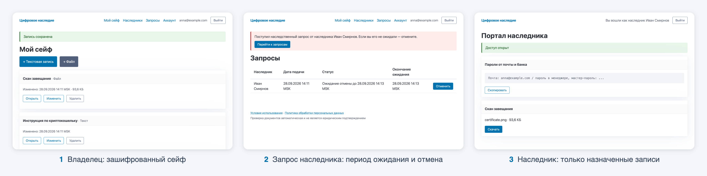

<p align="center">
  Веб-сервис цифрового наследия: владелец хранит зашифрованные записи и файлы, а наследник получает доступ по ключу только после автоматической проверки свидетельства о смерти и периода, в течение которого владелец может отменить запрос.
</p>

<p align="center">
  
  
  
  
  
  
  
</p>

<p align="center">
  
</p>

## Возможности

- **Зашифрованный сейф.** Текстовые записи и файлы шифруются AES-256-GCM; AAD привязывает шифротекст к конкретной записи, поэтому подмена файлов между записями обнаруживается при расшифровке. Пароли хешируются argon2id.
- **Наследники и ключи.** Каждому наследнику назначается свой набор записей. Ключ из 64 hex-символов показывается один раз, в базе хранится только его SHA-256; ключ можно перевыпустить.
- **Проверка документа.** Свидетельство о смерти (JPG, PNG или PDF) распознаётся EasyOCR на самом сервере, без внешних API. Правила сверяют заголовок, ФИО владельца (нечёткое сравнение), даты, серию и номер бланка или сведения о ЗАГС, а также активность владельца после даты документа.
- **Период ожидания.** После принятия документа владелец получает письмо и 14 дней может отменить запрос по ссылке или в кабинете; за 3 дня приходит напоминание. Отмена сразу отзывает ключ наследника.
- **Выдача.** Наследник видит и скачивает только назначенные ему записи. Документ удаляется после завершения запроса.
- **Безопасный отказ.** Переходы статусов атомарны (условный `UPDATE` с `FOR UPDATE`), гонка "отмена против выдачи" покрыта тестом. CSRF, ограничения частоты, CSP, `no-store` для страниц с данными; в логах нет ключей и токенов из ссылок.

## Архитектура

Один Docker-образ запускается в трёх ролях:

| Сервис | Назначение |
|---|---|
| `web` | FastAPI и серверные шаблоны Jinja2: кабинет владельца, портал наследника, `/healthz` |
| `worker` | Фоновый цикл: проверка документов через OCR, письма, напоминания, выдача по таймеру, очистка |
| `migrate` | Однократный `alembic upgrade head` перед стартом `web` и `worker` |

Данные хранятся в PostgreSQL и на томе `files` (только зашифрованные файлы). В разработке письма перехватывает Mailpit, в эксплуатации перед `web` стоит Caddy с автоматическим TLS.

Жизненный цикл запроса:

```text
PENDING_REVIEW -> DOCUMENT_ACCEPTED -> WAITING_CANCELLATION -> RELEASED
      |                   |                     |
      +-> REJECTED        |                     |
      +-------------------+---------------------+-> CANCELLED
```

Требования, модель данных, контракты и алгоритмы описаны в [`Архитектура.md`](Архитектура.md); принятые толкования спецификации и найденные в ней противоречия собраны в [`NOTES.md`](NOTES.md).

## Установка

Требуется Docker с Compose v2. Первая сборка скачивает PyTorch (CPU) и веса EasyOCR, образ занимает около 1.7 ГБ.

```bash
git clone https://github.com/TihonSotnikov/Digital-Legacy.git
cd Digital-Legacy
cp .env.example .env
```

В `.env` заполняются два обязательных ключа:

```bash
openssl rand -hex 32     # SECRET_KEY: подпись сессий и токенов ссылок
openssl rand -base64 32  # MASTER_KEY: ключ шифрования данных
```

Без `MASTER_KEY` данные не расшифровать: его копия хранится отдельно от сервера, минимум в двух местах.

Запуск:

```bash
docker compose up --build
```

- приложение: http://localhost:8000
- письма (Mailpit): http://localhost:8025
- состояние: http://localhost:8000/healthz

Для сквозной проверки вручную удобно сократить период ожидания в `.env` (`WAITING_PERIOD_SECONDS=120`, `REMINDER_BEFORE_SECONDS=60`) и сгенерировать синтетическое свидетельство на ФИО зарегистрированного владельца:

```bash
docker compose run --rm -T web sh -c 'python scripts/gen_fixtures.py --out /tmp/f --last Смирнова --first Анна --middle Сергеевна > /dev/null && cat /tmp/f/certificate.png' > certificate.png
```

Остальные параметры (лимиты, сроки, SMTP, OCR) описаны комментариями в [`.env.example`](.env.example).

## Тестирование

```bash
docker compose run --rm web pytest
```

272 теста, 1-2 минуты. Они покрывают все приёмочные сценарии спецификации (AT-01 - AT-31), включая распознавание реальным EasyOCR (маркер `ocr`), гонку отмены и выдачи, идемпотентность `worker`, шифрование на диске и отсутствие секретов в access-логе живого uvicorn. Тесты работают в отдельной базе `app_test` и не зависят от настроек `.env`.

## Развёртывание

В `.env` на сервере: `APP_ENV=prod`, `BASE_URL=https://<домен>`, `COOKIE_SECURE=true`, стойкий `POSTGRES_PASSWORD` (тот же пароль в `DATABASE_URL`), реальный SMTP. DNS-запись домена указывает на сервер, порты 80 и 443 открыты.

```bash
chmod 600 .env
docker compose -f docker-compose.yml -f docker-compose.prod.yml up -d --build
```

Caddy сам выпускает и продлевает сертификат для `BASE_URL`, Mailpit в эксплуатации не запускается, сервисы перезапускаются автоматически.

## Резервное копирование

`scripts/backup.sh` делает `pg_dump` базы и архив тома `files` в `backups/`, удаляет копии старше 14 дней и, если задан `BACKUP_REMOTE`, зеркалирует каталог через `rsync`. Переменные: `BACKUP_DIR`, `BACKUP_KEEP_DAYS`, `BACKUP_REMOTE`, `COMPOSE_FILE`. Запуск по cron:

```bash
15 3 * * * /opt/digital-legacy/scripts/backup.sh >> /var/log/digital-legacy-backup.log 2>&1
```

`.env` и `MASTER_KEY` в копию не входят. Восстановление на сервере с тем же `.env` (`<stamp>` - метка времени из имён файлов копии):

```bash
export COMPOSE_FILE=docker-compose.yml:docker-compose.prod.yml
docker compose up -d db
docker compose exec -T db pg_restore -U app -d app --clean --if-exists < backups/db-<stamp>.dump
docker compose run --rm --no-deps --user root -v "$PWD/backups:/backup" worker sh -c 'tar xzf /backup/files-<stamp>.tar.gz -C /data'
docker compose up -d --build
```
