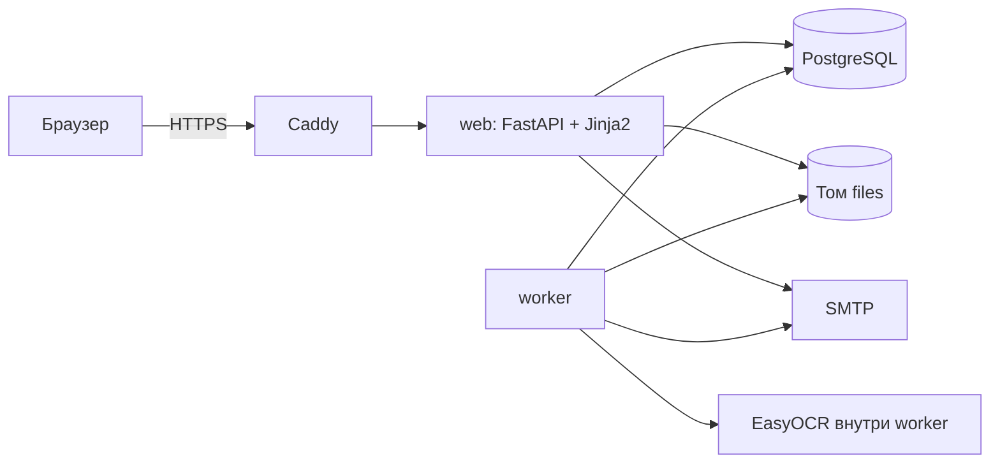
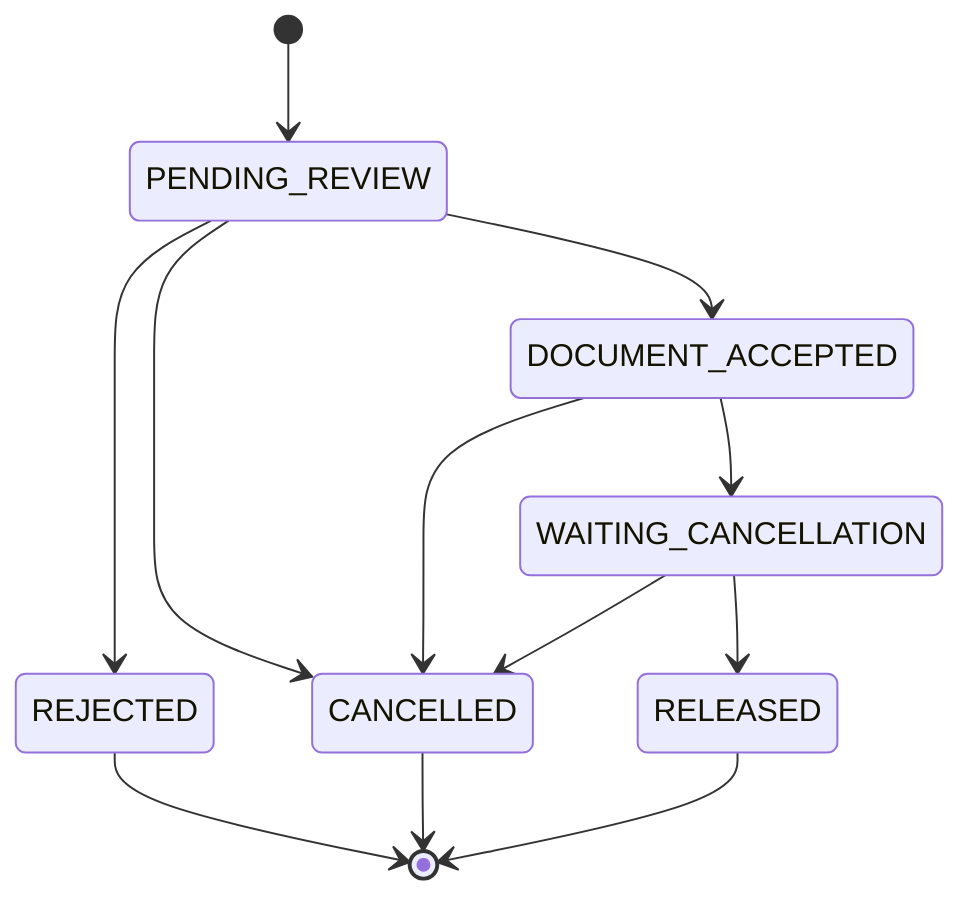

# Архитектура и техническое задание

**Сервис цифрового наследия — MVP**

Документ является единственным источником требований для реализации MVP. Слова «должен» и «обязан» обозначают обязательное требование, «может» — допустимое решение на усмотрение разработчика. Идентификаторы требований (FR-xx), писем (E1–E9), шагов Worker (A–E) и приёмочных тестов (AT-xx) используются в коде, тестах и коммитах для трассировки.

## Глоссарий

| Термин | Определение |
|---|---|
| Владелец | Зарегистрированный пользователь, который хранит данные и назначает наследников |
| Наследник | Лицо, которому Владелец передал ключ. Учётной записи не имеет |
| Запись | Единица хранимых данных: текстовая или файловая |
| Ключ наследника (ключ) | Случайная строка из 64 шестнадцатеричных символов, выдаваемая Владельцем Наследнику |
| Наследственный запрос (запрос) | Обращение Наследника с документом о смерти Владельца |
| Документ | Изображение или PDF свидетельства о смерти, загружаемое Наследником |
| Период ожидания | Интервал после уведомления Владельца, в течение которого запрос можно отменить. По умолчанию 14 дней |
| Активный запрос | Запрос в статусе `PENDING_REVIEW`, `DOCUMENT_ACCEPTED` или `WAITING_CANCELLATION` |
| Web | Процесс веб-приложения |
| Worker | Фоновый процесс: проверка документов, письма, таймеры |

---

# 1. ДЕКОМПОЗИЦИЯ БИЗНЕС-ТРЕБОВАНИЙ

## 1.1. Аудит бизнес-гипотезы

**Гипотеза.** Людям нужен простой способ сохранить важные цифровые данные (пароли, инструкции, документы) и передать их выбранным близким после своей смерти, не раскрывая их заранее.

**Ценность MVP:** сохранить данные → назначить наследников → после смерти Владельца Наследник подаёт документ → система проверяет его структуру, уведомляет Владельца и выдерживает период отмены → Наследник получает только назначенные ему данные.

### 1) Функциональные требования

#### Роли

- **Владелец** — хранит данные, управляет наследниками, получает уведомления и отменяет запросы.
- **Наследник** — входит по ключу, подаёт запрос, получает назначенные данные.
- **Система** — проверяет документы, отправляет письма, управляет состояниями запросов.

#### User stories

- Как Владелец, я хочу хранить пароли, заметки и файлы в зашифрованном виде.
- Как Владелец, я хочу назначить каждому наследнику свой набор записей.
- Как Владелец, я хочу узнавать о любом запросе и успевать его отменить, чтобы никто не получил данные при моей жизни.
- Как Наследник, я хочу получить данные без регистрации — по ключу и документу о смерти.

#### Перечень функций

| ID | Функция | Приоритет |
|---|---|---|
| FR-01 | Регистрация Владельца: email, пароль, фамилия, имя, отчество (необязательно), согласие с условиями; подтверждение email по ссылке | P0 |
| FR-02 | Вход и выход Владельца | P0 |
| FR-03 | Текстовые записи: создание, просмотр, редактирование, удаление; содержимое шифруется | P0 |
| FR-04 | Файловые записи: загрузка, скачивание, переименование, удаление; содержимое шифруется | P0 |
| FR-05 | Лимиты: количество записей и наследников, длина текста, размер файла, общий объём файлов | P0 |
| FR-06 | Наследники: создание, изменение имени и набора записей, удаление. Создание доступно только после подтверждения email | P0 |
| FR-07 | Ключ наследника: генерация при создании наследника, однократный показ, перевыпуск, автоматический отзыв при отмене запроса | P0 |
| FR-08 | Вход Наследника в портал по ключу | P0 |
| FR-09 | Подача запроса: загрузка документа и необязательного контактного email Наследника | P0 |
| FR-10 | Автоматическая структурная проверка документа (OCR + правила), включая сверку ФИО с данными Владельца | P0 |
| FR-11 | Уведомление Владельца о принятом запросе со ссылкой отмены (E2) и напоминание перед окончанием периода (E3) | P0 |
| FR-12 | Период ожидания и автоматическая выдача доступа по его окончании | P0 |
| FR-13 | Отмена запроса Владельцем: по ссылке из письма без входа и из личного кабинета | P0 |
| FR-14 | Список запросов в кабинете Владельца и баннер при наличии активного запроса | P0 |
| FR-15 | Выдача Наследнику только назначенных ему записей | P0 |
| FR-16 | Уведомления Наследника по email: отказ, начало ожидания, выдача, отмена (E6–E9) | P1 |
| FR-17 | Удаление аккаунта Владельцем с подтверждением паролем | P0 |
| FR-18 | Журнал аудита критических событий | P0 |
| FR-19 | Изменение ФИО Владельцем при отсутствии активных запросов | P1 |
| FR-20 | Уведомления Владельца об отклонённом запросе (E4) и о выдаче данных (E5) | P1 |

#### Сценарий Владельца

1. Регистрируется, указывая ФИО точно как в паспорте: по нему сверяется свидетельство о смерти.
2. Подтверждает email по ссылке из письма.
3. Добавляет текстовые и файловые записи.
4. Создаёт наследника и отмечает доступные ему записи.
5. Получает ключ (показывается один раз) и самостоятельно передаёт его наследнику.
6. Если документ по запросу принят, получает письмо со ссылкой отмены, а за 3 дня до окончания периода — напоминание. Активный запрос также виден баннером в кабинете.
7. Может отменить запрос по ссылке или в кабинете. Ключ наследника при отмене отзывается; при необходимости Владелец выпускает новый.
8. Если запрос не отменён, по окончании периода ожидания Наследник получает доступ к назначенным записям.

#### Сценарий Наследника

Регистрация не требуется.

1. Получает ключ от Владельца.
2. Открывает портал наследника и вводит ключ.
3. Загружает документ и, по желанию, свой email для уведомлений.
4. Ожидает проверки (обычно до 2 минут). При отказе видит причины и может загрузить другой документ.
5. После принятия документа видит дату, не ранее которой откроется доступ.
6. После выдачи просматривает текстовые записи и скачивает файлы, назначенные именно ему.

#### Проверка документа

Принимается только свидетельство о смерти установленного в Российской Федерации образца. Система распознаёт текст документа и проверяет:

- наличие заголовка «Свидетельство о смерти»;
- совпадение фамилии, имени и отчества с данными Владельца;
- наличие корректной даты;
- наличие серии и номера бланка или сведений об органе ЗАГС;
- отсутствие противоречия: Владелец не должен был входить в систему позже самой поздней даты в документе.

Проверка структурная. **Юридическая подлинность документа и факт смерти не подтверждаются.** Основная защита от преждевременной выдачи — уведомление Владельца, напоминание и период ожидания с возможностью отмены.

#### Период ожидания (Dead Man's Switch)

В MVP механизм Dead Man's Switch реализован как период ожидания после принятия документа:

1. Документ принят проверкой.
2. Система отправляет Владельцу письмо со ссылкой отмены.
3. **Отсчёт периода начинается только после того, как письмо принято SMTP-сервером.**
4. За `REMINDER_BEFORE_SECONDS` до окончания периода отправляется напоминание.
5. Владелец может отменить запрос в любой момент до выдачи доступа.
6. По окончании периода запрос автоматически переходит в `RELEASED`.

### 2) Верификация MVP

#### Сверка потребностей с решениями

| Потребность | Решение в MVP |
|---|---|
| Безопасно хранить данные | Записи, зашифрованные AES-256-GCM |
| Передать разным людям разное | Отдельный наследник со своим набором записей и своим ключом |
| Наследнику не нужна регистрация | Вход по ключу |
| Не отдать данные при жизни Владельца | Сверка ФИО, письмо, напоминание, баннер, период ожидания, отмена с отзывом ключа |
| Не отдать данные постороннему | 256-битный ключ, в БД только хеш, ограничение попыток |
| Узнать о запросе | Письма E2 и E3, баннер в кабинете |
| Полностью удалить свои данные | Удаление аккаунта без возможности восстановления |

#### Лимиты MVP

В MVP действует единый набор лимитов для всех Владельцев. Значения задаются конфигурацией (раздел 3.4).

| Параметр | По умолчанию | Переменная |
|---|---|---|
| Записей на Владельца (текст и файлы вместе) | 50 | `MAX_RECORDS` |
| Наследников на Владельца | 5 | `MAX_HEIRS` |
| Длина текста записи | 10 000 символов | `MAX_TEXT_CHARS` |
| Размер одного файла | 10 МБ | `MAX_FILE_MB` |
| Общий объём файлов Владельца | 100 МБ | `MAX_STORAGE_MB` |
| Размер документа | 10 МБ | `MAX_DOC_MB` |
| Запросов по одному ключу за 24 часа | 3 | `HEIR_REQUESTS_PER_DAY` |
| Период ожидания | 14 дней | `WAITING_PERIOD_SECONDS` |
| Напоминание до окончания периода | 3 дня | `REMINDER_BEFORE_SECONDS` |

#### Не входит в MVP

- оплата, тарифы;
- сброс и смена пароля, смена email;
- двухфакторная аутентификация;
- client-side и zero-knowledge шифрование;
- другие типы документов (выписки из реестра ЗАГС, иностранные свидетельства);
- интеграция с государственными реестрами;
- уведомления по SMS и в мессенджерах;
- административная панель и разбор спорных ситуаций;
- ротация мастер-ключа шифрования;
- автоматическое удаление данных после выдачи;
- мобильные приложения, мультиязычность, аналитика;
- объектные хранилища, брокеры очередей, микросервисы.

### 3) Нефункциональные требования

#### Принцип безопасного отказа

Любой сбой Worker, OCR или почты может только **задержать** выдачу доступа, но не ускорить её и не допустить выдачу без уведомления Владельца. Этот принцип имеет приоритет над остальными требованиями.

#### Время отклика

| Операция | Требование |
|---|---|
| Открытие страницы | ≤ 1 с (p95) |
| Сохранение записи, наследника, настроек | ≤ 1 с (p95) без учёта передачи файла по сети |
| Создание запроса | ≤ 1 с (p95) без учёта передачи файла по сети |
| Проверка документа: от подачи до решения | ≤ 2 мин при пустой очереди |
| Отправка письма E2 после принятия документа | ≤ 1 мин при доступном SMTP |
| Выдача доступа после окончания периода | ≤ 1 мин |
| Страница с выданными данными (до 50 записей) | ≤ 2 с (p95) |

Проверка документов, письма и таймеры выполняются в Worker. Web никогда не ждёт OCR.

Проектная нагрузка: до 1 000 Владельцев, до 50 запросов в сутки.

#### Безопасность и приватность

- В эксплуатации все соединения только по HTTPS, заголовок HSTS включён.
- Содержимое записей, файлы и документы хранятся зашифрованными AES-256-GCM (3.2.1). Шифрование серверное: оно защищает от утечки базы данных, диска и резервных копий без мастер-ключа, но не от компрометации работающего сервера или оператора. Это явно указывается в условиях использования.
- Пароли хешируются argon2id; минимальная длина пароля — 10 символов.
- Ключ наследника хранится только в виде SHA-256-хеша и показывается Владельцу один раз.
- Токены ссылок (подтверждение email, отмена запроса) подписываются `SECRET_KEY` и в БД не хранятся.
- Сессионная cookie: `HttpOnly`, `SameSite=Lax`, `Secure` в эксплуатации.
- Каждая форма, изменяющая состояние, защищена CSRF-токеном.
- Ограничения частоты запросов — по таблице 3.1.4.
- Заголовки ответа: `Content-Security-Policy: default-src 'self'`, `X-Frame-Options: DENY`, `X-Content-Type-Options: nosniff`, `Referrer-Policy: no-referrer`. Последний не даёт токенам из URL утечь через заголовок Referer.
- Страницы и ответы с секретами или расшифрованными данными отдаются с `Cache-Control: no-store`.
- Владелец видит только свои объекты; обращение к чужому объекту возвращает 404.
- В логи не попадают пароли, ключи, токены, содержимое записей и текст документов. Токены в путях URL маскируются в access-логе.
- Скачивание файлов всегда выполняется с `Content-Disposition: attachment`.
- Пути хранения файлов строятся только из UUID, пользовательские имена файлов в путях не используются.

#### Аудит

Критические события записываются в таблицу `audit_events` (перечень типов — в 3.2.10):

- регистрация, подтверждение email, вход;
- создание, изменение и удаление записей и наследников;
- выпуск и отзыв ключей;
- создание запроса и каждая смена его статуса;
- уведомления Владельца;
- просмотр и скачивание данных Наследником.

Журнал в интерфейсе не отображается.

#### Хранение состояний

Для каждого запроса хранятся текущий статус, результат проверки и отметки времени: создания, уведомления, напоминания, окончания ожидания, выдачи, отмены, отклонения. История переходов хранится в журнале аудита. Переходы строго ограничены машиной состояний (2.3.4); повторная выдача исключена.

#### Надёжность и эксплуатация

- Все сервисы работают с политикой перезапуска `unless-stopped`.
- Worker раз в цикл записывает heartbeat. `/healthz` сообщает о зависании Worker.
- Ежедневное резервное копирование базы данных и тома с файлами; RPO — 24 часа.
- Хостинг — один VPS на территории РФ.

#### Совместимость

- Две последние версии Chrome, Firefox, Safari, Edge; мобильные экраны шириной от 360 px.
- Язык интерфейса и писем — русский.
- Время хранится в UTC, отображается в часовом поясе `DISPLAY_TZ` (по умолчанию `Europe/Moscow`) с указанием пояса.

## 1.2. Анализ ограничений и границ

### 1) Внешние ограничения

**Почта.**
- Используется любой SMTP-провайдер.
- Для доставки в эксплуатации нужен собственный домен с записями SPF, DKIM и DMARC.
- Провайдеры ограничивают суточный объём отправки; письма могут задерживаться или попадать в спам. Поэтому помимо письма есть напоминание и баннер в кабинете.
- В разработке используется локальный перехватчик писем Mailpit, в тестах — хранилище писем в памяти.

**OCR.**
- Распознавание выполняется локально библиотекой EasyOCR на CPU, в процессе Worker.
- Ориентировочно 10–40 секунд на изображение в зависимости от процессора; до 3 ГБ RAM во время распознавания.
- Веса моделей загружаются при сборке Docker-образа, во время работы доступ в интернет для OCR не нужен.
- Документы не передаются третьим лицам.

**Хостинг.** Один VPS в РФ: не менее 4 vCPU, 8 ГБ RAM, 40 ГБ SSD; Docker и Docker Compose.

**Персональные данные (152-ФЗ).**
- Данные хранятся на сервере в РФ.
- При регистрации запрашивается согласие на обработку персональных данных.
- Распознанный текст документа не сохраняется.

### 2) Ресурсы команды

- Реализацию выполняет один разработчик с помощью Claude Code: код и тесты пишутся в одной расширенной сессии, ручные работы (4.5) выполняются после неё.
- Отсюда архитектурные требования:
  - единая кодовая база без отдельной сборки фронтенда;
  - разработка и тесты не требуют внешних учётных записей и сервисов;
  - все проверки готовности автоматизированы.

### 3) Границы работы с данными

#### Входные данные Владельца

| Данные | Ограничения |
|---|---|
| ФИО | Фамилия и имя обязательны, отчество необязательно; каждая часть 1–100 символов: буквы, пробел, дефис |
| Email | Корректный адрес, хранится в нижнем регистре |
| Пароль | Не менее 10 символов |
| Название записи | 1–200 символов, хранится в открытом виде |
| Текст записи | UTF-8, до `MAX_TEXT_CHARS` символов |
| Файл записи | JPG, PNG, PDF, DOCX, XLSX, ZIP, TXT; до `MAX_FILE_MB`; общий объём до `MAX_STORAGE_MB` |
| Имя наследника | 1–100 символов |

Тип файла проверяется по расширению и сигнатуре:

| Формат | Сигнатура |
|---|---|
| JPG | `FF D8 FF` |
| PNG | `89 50 4E 47` |
| PDF | `%PDF` |
| DOCX, XLSX, ZIP | `50 4B 03 04` |
| TXT | Корректный UTF-8 |

#### Входные данные Наследника

- **Ключ:** 64 символа `0-9a-f`, регистр не важен, пробельные символы удаляются.
- **Документ:** JPG, PNG или PDF, до `MAX_DOC_MB`. У PDF проверяется только первая страница.
- **Контактный email:** необязателен.

#### Выходные данные Наследника

- HTML-страница с расшифрованными текстовыми записями.
- Файлы скачиваются через приложение с исходным именем.

#### Внутренние данные проверки

- Распознанный текст существует только в памяти Worker во время проверки.
- Сохраняется только `check_result`: флаги правил и коды причин отказа. ФИО и текст документа не сохраняются.

### 4) Жизненный цикл данных

| Данные | Где | Срок хранения |
|---|---|---|
| Учётная запись, ФИО, хеш пароля | PostgreSQL | До удаления аккаунта |
| Записи (зашифрованы) | PostgreSQL, том `files` | До удаления записи или аккаунта |
| Наследники и назначения доступа | PostgreSQL | До удаления наследника или аккаунта |
| Хеши ключей, включая отозванные | PostgreSQL | До удаления наследника или аккаунта |
| Запросы и результаты проверки | PostgreSQL | До удаления наследника или аккаунта |
| Журнал аудита | PostgreSQL | До удаления аккаунта |
| Документ (зашифрован) | Том `files` | До решения по проверке или отмены запроса, затем удаляется Worker (шаг E) |
| Сессии | Подписанная cookie | До выхода или истечения срока |
| Ссылки подтверждения email | Не хранятся | Действуют 48 часов |
| Ссылки отмены | Не хранятся | Действуют, пока запрос активен |
| Резервные копии | Внешнее хранилище | 14 дней |

Исходный ключ наследника не хранится и показывается Владельцу один раз. После выдачи данные остаются доступны Наследнику до удаления аккаунта Владельца либо до перевыпуска ключа Владельцем.

### 5) Удаление данных при закрытии аккаунта

- Удаление аккаунта необратимо; мягкое удаление не используется.
- В одной транзакции каскадно удаляются: пользователь, записи, наследники, ключи, назначения доступа, запросы и журнал аудита.
- После фиксации транзакции с диска удаляются файлы записей и документы.
- Ключи наследников перестают работать.
- Данные остаются в резервных копиях не дольше 14 дней. Это указывается в политике обработки персональных данных.

---

# 2. ПРОЕКТИРОВАНИЕ АРХИТЕКТУРЫ

Принцип: архитектура минимальна, но достаточна. Каждый компонент обязан закрывать конкретное требование раздела 1.

## 2.1. Выбор компонентного состава

### 1) Клиентская часть

**Формат:** HTML, который сервер рендерит шаблонами Jinja2 в том же приложении FastAPI.

**Обоснование:**
- одна кодовая база и один язык;
- нет отдельной сборки фронтенда, CORS и передачи токенов между клиентом и сервером;
- простые страницы надёжно работают на телефоне, что важно для Наследника в стрессовой ситуации.

**Стек:**
- Pico.css — локальная копия в `app/static`, без CDN.
- Минимальный JavaScript в `app/static/app.js`, только для:
  - копирования в буфер обмена;
  - блокировки кнопки отправки с текстом загрузки;
  - отображения имени выбранного файла;
  - клиентской проверки формата ключа.
- Inline-скрипты и inline-стили не используются (требование CSP).

### 2) Серверная часть

**Формат:** монолит. Один Docker-образ, два процесса:
- **web** — `uvicorn app.main:app`, один процесс;
- **worker** — `python -m app.worker`, один экземпляр.

**Стек:**

| Назначение | Библиотека |
|---|---|
| Язык | Python 3.12 |
| Веб-фреймворк | FastAPI, Uvicorn |
| Шаблоны | Jinja2 |
| Работа с БД | SQLAlchemy 2 (синхронный режим), psycopg 3 |
| Миграции | Alembic |
| Конфигурация | pydantic-settings |
| Пароли | argon2-cffi |
| Шифрование | cryptography (AESGCM) |
| Подписанные токены и сессии | itsdangerous, Starlette `SessionMiddleware` |
| Ограничение частоты | slowapi (хранение в памяти) |
| Загрузка файлов | python-multipart |
| Валидация email | email-validator |
| Нечёткое сравнение | rapidfuzz |
| Изображения | Pillow |
| PDF | PyMuPDF |
| OCR | easyocr (PyTorch в CPU-сборке) |
| Тесты | pytest |

**Web отвечает за:**
- маршруты и шаблоны;
- аутентификацию, сессии, CSRF, rate limiting;
- валидацию, шифрование и расшифрование;
- CRUD записей и наследников;
- приём документов;
- отмену запросов;
- выдачу данных;
- письма E1 и E9.

**Worker отвечает за:**
- проверку документов;
- письма E2–E8;
- напоминания;
- выдачу по таймеру;
- очистку документов;
- heartbeat.

Модель OCR загружается только в Worker, один раз при старте.

### 3) Хранилища данных

**PostgreSQL 16.** Хранит все структурированные данные. Одновременно служит очередью задач Worker: задачами являются сами запросы в соответствующих статусах. Здесь же хранится heartbeat Worker.

**Том `files`.** Общий для web и worker. Содержит зашифрованные файлы:
- `records/{record_id}.bin` — файлы записей;
- `docs/{request_id}.bin` — временные документы.

**Что не используется и почему:**
- Отдельный брокер очередей не нужен: при проектной нагрузке Worker достаточно опрашивать PostgreSQL.
- Объектное хранилище не нужно: объём данных помещается на диск VPS.
- Состояние rate limiting хранится в памяти единственного процесса web.

### 4) Вычислительные мощности и интеграции

- **OCR:** EasyOCR (языки `ru`, `en`) на CPU внутри Worker, за интерфейсом `OcrProvider` с реализациями `easyocr` и `fake`. Документы не покидают сервер.
- **Почта:** SMTP через интерфейс `EmailBackend` с реализациями:
  - `smtp` — эксплуатация и разработка (Mailpit);
  - `memory` — тесты;
  - `console` — отладка.
- **Обратный прокси в эксплуатации:** Caddy с автоматическим выпуском TLS-сертификата.
- **Шифрование:** AES-256-GCM из библиотеки `cryptography`.

## 2.2. Архитектурная схема

### 1) Диаграмма компонентов



Сервисы Docker Compose:

| Сервис | Назначение | Окружение |
|---|---|---|
| `db` | PostgreSQL 16, том `pgdata`; скрипт инициализации создаёт дополнительную базу `app_test` | все |
| `migrate` | Однократный запуск `alembic upgrade head` | все |
| `web` | Приложение, порт 8000; стартует после успешного `migrate` | все |
| `worker` | Фоновый процесс; стартует после успешного `migrate` | все |
| `mailpit` | Перехватчик писем: SMTP на порту 1025, веб-интерфейс на 8025 | разработка |
| `caddy` | TLS и обратный прокси | эксплуатация |

### 2) Сценарий А: Владелец сохраняет запись

1. Владелец отправляет форму с текстом или файлом.
2. Web проверяет сессию и CSRF-токен, затем тип, размер и лимиты (FR-05). Файл читается потоково; при превышении лимита чтение прерывается.
3. Web генерирует `record_id`.
4. Содержимое шифруется с AAD `record:{record_id}`:
   - текст сохраняется в `records.ciphertext`;
   - файл записывается в `records/{record_id}.bin` через временный файл с последующим переименованием.
5. Строка записи и событие `RECORD_CREATED` сохраняются в одной транзакции. При ошибке транзакции файл удаляется.
6. Web перенаправляет на `/vault` с сообщением «Запись сохранена».

### 3) Сценарий Б: Владелец создаёт наследника

1. Владелец отправляет имя наследника и список `record_ids`.
2. Web проверяет:
   - email Владельца подтверждён;
   - лимит `MAX_HEIRS` не превышен;
   - все `record_ids` принадлежат Владельцу.
3. Генерируется ключ `secrets.token_hex(32)`; в БД сохраняется `sha256(key)`.
4. В одной транзакции создаются наследник, ключ, назначения доступа и события `HEIR_CREATED`, `HEIR_KEY_ISSUED`.
5. Ключ кладётся во flash-поле сессии, и Web перенаправляет на `/heirs/{id}/key`.
6. Эта страница показывает ключ один раз и удаляет его из сессии.

### 4) Сценарий В: Наследник подаёт запрос

1. Наследник вводит ключ на `/heir`. Web нормализует ключ, находит неотозванный ключ по хешу и создаёт сессию наследника.
2. Наследник загружает документ и, по желанию, контактный email.
3. Web проверяет:
   - нет активного запроса наследника и выданного запроса по текущему ключу;
   - не превышен суточный лимит запросов по ключу;
   - документ подходит по типу, сигнатуре и размеру.
4. Генерируется `request_id`. Документ шифруется с AAD `doc:{request_id}` и записывается в `docs/{request_id}.bin`.
5. Создаётся запрос в статусе `PENDING_REVIEW` и событие `REQUEST_CREATED`.
6. Наследник перенаправляется на `/heir/portal` со статусом «Документ на проверке».

### 5) Сценарий Г: Проверка документа (Worker, шаг A)

1. Worker берёт самый ранний запрос в `PENDING_REVIEW`.
2. Расшифровывает документ и готовит изображение (3.2.7).
3. Распознаёт текст через `OcrProvider`.
4. Применяет правила проверки (3.2.8).
5. Выполняет переход:
   - правила пройдены → `DOCUMENT_ACCEPTED`;
   - правила не пройдены → `REJECTED` с причинами.
6. Технические ошибки OCR повторяются до `OCR_MAX_ATTEMPTS` попыток, после чего запрос переходит в `REJECTED` с причиной `OCR_UNAVAILABLE`.

### 6) Сценарий Д: Уведомление и ожидание (Worker, шаги B и C)

1. Для запроса в `DOCUMENT_ACCEPTED` Worker отправляет Владельцу письмо E2 со ссылкой отмены.
2. Только после того, как SMTP-сервер принял письмо, запрос переходит в `WAITING_CANCELLATION` с `notified_at = now` и `waiting_until = now + WAITING_PERIOD_SECONDS`.
3. При ошибке отправки статус не меняется, попытка повторяется на следующем цикле.
4. При наступлении `waiting_until − REMINDER_BEFORE_SECONDS` Worker отправляет напоминание E3.

### 7) Сценарий Е: Отмена запроса

1. Владелец открывает ссылку `/cancel/{token}` из письма (вход не нужен) или нажимает «Отменить» на `/requests`.
2. В одной транзакции выполняется условный переход «активный статус → `CANCELLED`» и отзывается ключ, по которому подан запрос.
3. Документ, если он ещё хранится, удаляет Worker на шаге E.

### 8) Сценарий Ж: Выдача доступа (Worker, шаг D) и просмотр данных

1. Worker находит запросы в `WAITING_CANCELLATION` с `waiting_until ≤ now` и выполняет условный переход в `RELEASED`.
2. Наследник входит по ключу. Web проверяет, что по текущему ключу есть запрос в `RELEASED`.
3. Web расшифровывает назначенные текстовые записи и показывает их.
4. Файлы скачиваются через `/heir/files/{record_id}` с проверкой назначения доступа.

## 2.3. Проектирование модели данных

### 1) Схема сущностей и связей

Эталонная схема PostgreSQL. Миграция Alembic должна создать эквивалентную структуру.

```sql
CREATE TABLE users (
    id                 UUID PRIMARY KEY,
    email              TEXT NOT NULL UNIQUE,          -- в нижнем регистре
    password_hash      TEXT NOT NULL,                 -- argon2id
    last_name          TEXT NOT NULL,
    first_name         TEXT NOT NULL,
    middle_name        TEXT,                          -- NULL, если отчества нет
    email_verified_at  TIMESTAMPTZ,
    last_login_at      TIMESTAMPTZ,
    created_at         TIMESTAMPTZ NOT NULL
);

CREATE TABLE records (
    id                 UUID PRIMARY KEY,
    user_id            UUID NOT NULL REFERENCES users(id) ON DELETE CASCADE,
    type               TEXT NOT NULL CHECK (type IN ('text', 'file')),
    title              TEXT NOT NULL CHECK (char_length(title) BETWEEN 1 AND 200),
    ciphertext         BYTEA,       -- только text: nonce(12) || шифротекст с тегом
    file_name          TEXT,        -- только file: исходное имя, только для отображения
    mime_type          TEXT,        -- только file
    size_bytes         BIGINT NOT NULL CHECK (size_bytes >= 0),  -- размер открытых данных
    key_version        SMALLINT NOT NULL DEFAULT 1,
    created_at         TIMESTAMPTZ NOT NULL,
    updated_at         TIMESTAMPTZ NOT NULL,
    CHECK (
        (type = 'text' AND ciphertext IS NOT NULL AND file_name IS NULL AND mime_type IS NULL)
     OR (type = 'file' AND ciphertext IS NULL AND file_name IS NOT NULL AND mime_type IS NOT NULL)
    )
);
CREATE INDEX records_user_idx ON records (user_id);

CREATE TABLE heirs (
    id                 UUID PRIMARY KEY,
    user_id            UUID NOT NULL REFERENCES users(id) ON DELETE CASCADE,
    name               TEXT NOT NULL CHECK (char_length(name) BETWEEN 1 AND 100),
    created_at         TIMESTAMPTZ NOT NULL
);
CREATE INDEX heirs_user_idx ON heirs (user_id);

CREATE TABLE heir_keys (
    id                 UUID PRIMARY KEY,
    heir_id            UUID NOT NULL REFERENCES heirs(id) ON DELETE CASCADE,
    key_hash           CHAR(64) NOT NULL UNIQUE,      -- sha256, hex
    created_at         TIMESTAMPTZ NOT NULL,
    revoked_at         TIMESTAMPTZ
);
CREATE UNIQUE INDEX heir_keys_one_active_idx ON heir_keys (heir_id) WHERE revoked_at IS NULL;

CREATE TABLE heir_record_access (
    heir_id            UUID NOT NULL REFERENCES heirs(id) ON DELETE CASCADE,
    record_id          UUID NOT NULL REFERENCES records(id) ON DELETE CASCADE,
    PRIMARY KEY (heir_id, record_id)
);

CREATE TABLE inheritance_requests (
    id                 UUID PRIMARY KEY,
    heir_id            UUID NOT NULL REFERENCES heirs(id) ON DELETE CASCADE,
    heir_key_id        UUID NOT NULL REFERENCES heir_keys(id) ON DELETE CASCADE,
    status             TEXT NOT NULL CHECK (status IN (
                           'PENDING_REVIEW', 'DOCUMENT_ACCEPTED', 'WAITING_CANCELLATION',
                           'RELEASED', 'REJECTED', 'CANCELLED')),
    heir_contact_email TEXT,
    doc_mime_type      TEXT NOT NULL CHECK (doc_mime_type IN ('image/jpeg', 'image/png', 'application/pdf')),
    doc_stored         BOOLEAN NOT NULL DEFAULT TRUE, -- временный файл документа ещё на диске
    ocr_attempts       SMALLINT NOT NULL DEFAULT 0,
    check_result       JSONB,
    notified_at        TIMESTAMPTZ,
    waiting_until      TIMESTAMPTZ,
    reminder_sent_at   TIMESTAMPTZ,
    released_at        TIMESTAMPTZ,
    cancelled_at       TIMESTAMPTZ,
    rejected_at        TIMESTAMPTZ,
    created_at         TIMESTAMPTZ NOT NULL,
    updated_at         TIMESTAMPTZ NOT NULL,
    CHECK (status <> 'WAITING_CANCELLATION' OR (notified_at IS NOT NULL AND waiting_until IS NOT NULL)),
    CHECK (status <> 'RELEASED'  OR (released_at IS NOT NULL AND waiting_until IS NOT NULL)),
    CHECK (status <> 'CANCELLED' OR cancelled_at IS NOT NULL),
    CHECK (status <> 'REJECTED'  OR (rejected_at IS NOT NULL AND check_result IS NOT NULL))
);
CREATE UNIQUE INDEX requests_one_active_per_heir_idx ON inheritance_requests (heir_id)
    WHERE status IN ('PENDING_REVIEW', 'DOCUMENT_ACCEPTED', 'WAITING_CANCELLATION');
CREATE INDEX requests_status_idx ON inheritance_requests (status, waiting_until);
CREATE INDEX requests_key_created_idx ON inheritance_requests (heir_key_id, created_at);

CREATE TABLE audit_events (
    id                 BIGSERIAL PRIMARY KEY,
    user_id            UUID NOT NULL REFERENCES users(id) ON DELETE CASCADE,  -- Владелец, к которому относится событие
    request_id         UUID REFERENCES inheritance_requests(id) ON DELETE SET NULL,
    event_type         TEXT NOT NULL,
    meta               JSONB NOT NULL DEFAULT '{}'::jsonb,  -- без секретов и содержимого
    created_at         TIMESTAMPTZ NOT NULL
);
CREATE INDEX audit_user_created_idx ON audit_events (user_id, created_at);

CREATE TABLE system_state (
    key                TEXT PRIMARY KEY,              -- 'worker_heartbeat'
    value              TEXT NOT NULL,
    updated_at         TIMESTAMPTZ NOT NULL
);
```

**Связи:**
- `users` 1:N `records`, `heirs`, `audit_events`.
- `heirs` 1:N `heir_keys`, из них не более одного неотозванного.
- `heirs` N:M `records` через `heir_record_access`.
- `heirs` 1:N `inheritance_requests`, из них не более одного активного.
- `heir_keys` 1:N `inheritance_requests`.

Расположение файлов вычисляется из идентификаторов: `FILES_DIR/records/{records.id}.bin`, `FILES_DIR/docs/{inheritance_requests.id}.bin`.

### 2) Правила целостности данных

**На уровне БД:** ограничения схемы выше — уникальность, CHECK, частичные уникальные индексы.

**На уровне приложения (покрываются тестами):**
- Наследник и назначаемая ему запись принадлежат одному Владельцу.
- Email приводится к нижнему регистру до сохранения и поиска.
- Все отметки времени задаёт приложение из `app.clock.now()`. В SQL-запросах функция `now()` не используется; текущее время передаётся параметром.
- Статус запроса меняется только функцией `transition()` (3.2.5).
- Наследника нельзя удалить и нельзя перевыпустить его ключ, пока у него есть активный запрос.
- ФИО Владельца нельзя изменить, пока у него есть активный запрос.

### 3) Каскадное удаление

| Удаляется | Каскадом удаляются | Файлы на диске |
|---|---|---|
| `users` | `records`, `heirs`, `heir_keys`, `heir_record_access`, `inheritance_requests`, `audit_events` | Web удаляет файлы записей и документов после фиксации транзакции |
| `heirs` (только без активного запроса) | `heir_keys`, `heir_record_access`, завершённые `inheritance_requests`; у событий аудита `request_id` обнуляется | Документов нет: у завершённых запросов они уже удалены |
| `records` | `heir_record_access` | Web удаляет файл записи после фиксации транзакции |

Отсутствие файла при удалении ошибкой не считается.

### 4) Ограничения состояний (State Machine)



| Из | В | Кто выполняет | Условие | Поля, которые устанавливаются |
|---|---|---|---|---|
| `PENDING_REVIEW` | `DOCUMENT_ACCEPTED` | Worker, шаг A | Правила проверки пройдены | `check_result` |
| `PENDING_REVIEW` | `REJECTED` | Worker, шаг A | Правила не пройдены, документ не читается или исчерпаны попытки OCR | `check_result`, `rejected_at` |
| `PENDING_REVIEW` | `CANCELLED` | Владелец | Отмена | `cancelled_at`; ключ отзывается |
| `DOCUMENT_ACCEPTED` | `WAITING_CANCELLATION` | Worker, шаг B | Письмо E2 принято SMTP | `notified_at`, `waiting_until` |
| `DOCUMENT_ACCEPTED` | `CANCELLED` | Владелец | Отмена | `cancelled_at`; ключ отзывается |
| `WAITING_CANCELLATION` | `RELEASED` | Worker, шаг D | `waiting_until ≤ now` | `released_at` |
| `WAITING_CANCELLATION` | `CANCELLED` | Владелец | Отмена | `cancelled_at`; ключ отзывается |

- Статусы `REJECTED`, `CANCELLED` и `RELEASED` терминальные. Любой переход, отсутствующий в таблице, запрещён.
- После `REJECTED` Наследник может подать новый запрос с тем же ключом, в пределах суточного лимита.
- После `CANCELLED` ключ отозван, новый запрос возможен только с новым ключом.

---

# 3. РАЗРАБОТКА ТЕХНИЧЕСКОГО ЗАДАНИЯ

## 3.1. Спецификация контрактов взаимодействия

### 1) Протокол обмена данными

**Транспорт и формат.**
- HTTPS (в разработке — HTTP на `localhost`).
- Браузер отправляет HTML-формы: `application/x-www-form-urlencoded`, для файлов — `multipart/form-data`. Поле со списком передаётся повторяющимся именем (`record_ids=...&record_ids=...`).
- Изменяющие состояние действия выполняются только методом `POST`. Все `POST`-формы содержат скрытое поле `csrf_token`.

**Ответы.**
- Успешный `POST` возвращает `303 See Other` на страницу результата (Post/Redirect/Get). Сообщение об успехе передаётся flash-сообщением через сессию.
- Ошибка валидации возвращает ту же форму с введёнными данными (кроме паролей, ключей и файлов), сообщениями у полей и HTTP-статусом из таблицы 3.1.3.
- Ошибка, возникшая после действия с перенаправлением, передаётся flash-сообщением.
- Каждый элемент с сообщением об ошибке — у поля, flash или на странице ошибки — имеет атрибут `data-error-code="<КОД>"`. Тесты проверяют HTTP-статус и этот атрибут.

**Аутентификация.**
- Владелец — поле `uid` в сессии. Неаутентифицированный запрос к маршруту Владельца → `303` на `/login?next=<путь>`. Параметр `next` принимается, только если начинается с `/` и не начинается с `//`.
- Наследник — поля `hkid` и `hk_auth_at` в той же сессии. Неаутентифицированный запрос к маршруту портала → `303` на `/heir`.

**Служебный JSON-эндпоинт:** `/healthz`.

### 2) Маршруты

#### Публичные

| Метод | Путь | Параметры | Результат |
|---|---|---|---|
| GET | `/` | — | Лендинг |
| GET | `/terms`, `/privacy` | — | Условия использования, политика обработки ПДн |
| GET | `/register` | — | Форма регистрации |
| POST | `/register` | `email`, `password`, `password_confirm`, `last_name`, `first_name`, `middle_name`, `consent` | Создание Владельца, вход, письмо E1 → `303 /vault` |
| GET | `/login` | `next` | Форма входа |
| POST | `/login` | `email`, `password`, `next` | `303` на `next` или `/vault` |
| GET | `/verify-email/{token}` | — | Подтверждение email → `303 /vault` (или `/login`) с flash |
| GET | `/cancel/{token}` | — | Страница с данными запроса и кнопкой отмены |
| POST | `/cancel/{token}` | — | Отмена → `303 /cancel/{token}` с результатом |
| GET | `/healthz` | — | JSON (3.1.5) |

#### Владелец (требуется вход)

| Метод | Путь | Параметры | Результат |
|---|---|---|---|
| POST | `/logout` | — | `303 /` |
| POST | `/verify-email/resend` | — | Повторная отправка E1 → `303` назад |
| GET | `/vault` | — | Список записей, счётчики лимитов |
| GET | `/records/new` | `type=text\|file` | Форма записи |
| POST | `/records` | `type`, `title`, `content` (text) или `file` (file) | `303 /vault` |
| GET | `/records/{id}` | — | Просмотр записи; текст расшифрован; `no-store` |
| GET | `/records/{id}/edit` | — | Форма редактирования; `no-store` |
| POST | `/records/{id}/edit` | `title`, `content` (только text) | `303 /records/{id}` |
| POST | `/records/{id}/delete` | — | `303 /vault` |
| GET | `/records/{id}/download` | — | Файл записи, `attachment`, `no-store` |
| GET | `/heirs` | — | Список наследников |
| GET | `/heirs/new` | — | Форма наследника |
| POST | `/heirs` | `name`, `record_ids` | `303 /heirs/{id}/key` |
| GET | `/heirs/{id}/key` | — | Однократный показ ключа; `no-store` |
| GET | `/heirs/{id}/edit` | — | Форма редактирования |
| POST | `/heirs/{id}/edit` | `name`, `record_ids` | `303 /heirs` |
| POST | `/heirs/{id}/regenerate-key` | — | Отзыв старого ключа, выпуск нового → `303 /heirs/{id}/key` |
| POST | `/heirs/{id}/delete` | — | `303 /heirs` |
| GET | `/requests` | — | Запросы по всем наследникам Владельца |
| POST | `/requests/{id}/cancel` | — | `303 /requests` |
| GET | `/account` | — | Настройки аккаунта |
| POST | `/account/profile` | `last_name`, `first_name`, `middle_name` | `303 /account` (P1) |
| POST | `/account/delete` | `password` | Удаление аккаунта → `303 /` |

#### Наследник

| Метод | Путь | Параметры | Доступ | Результат |
|---|---|---|---|---|
| GET | `/heir` | — | Публичный | Форма ввода ключа |
| POST | `/heir/login` | `key` | Публичный | Сессия наследника → `303 /heir/portal` |
| GET | `/heir/portal` | — | Сессия наследника | Страница по состоянию (3.3.3); `no-store` |
| POST | `/heir/request` | `document`, `contact_email` | Сессия наследника | Создание запроса → `303 /heir/portal` |
| GET | `/heir/files/{record_id}` | — | Сессия наследника, доступ выдан | Файл, `attachment`, `no-store` |
| POST | `/heir/logout` | — | Сессия наследника | `303 /heir` |

### 3) Коды ошибок

| Код | HTTP | Когда | Сообщение пользователю |
|---|---|---|---|
| `VALIDATION_ERROR` | 400 | Поле не прошло проверку | Текст у поля, например «Пароль должен быть не короче 10 символов» |
| `EMAIL_TAKEN` | 400 | Email уже зарегистрирован | «Этот email уже зарегистрирован» |
| `INVALID_CREDENTIALS` | 401 | Неверный email или пароль; неверный пароль при удалении аккаунта | «Неверный email или пароль» / «Неверный пароль» |
| `INVALID_KEY` | 401 | Ключ неверного формата, не найден или отозван | «Ключ не найден или недействителен» |
| `INVALID_TOKEN` | 400 | Неверная подпись ссылки или истёк срок | «Ссылка недействительна или устарела» |
| `CSRF_FAILED` | 403 | CSRF-токен отсутствует или неверен | «Сессия устарела. Обновите страницу и повторите действие» |
| `EMAIL_NOT_VERIFIED` | 403 | Создание наследника без подтверждённого email | «Подтвердите email, чтобы добавить наследника» |
| `NOT_FOUND` | 404 | Объекта нет, он принадлежит другому Владельцу, запись не назначена Наследнику или доступ не выдан | «Страница не найдена» |
| `LIMIT_EXCEEDED` | 409 | Превышен `MAX_RECORDS`, `MAX_HEIRS` или `MAX_STORAGE_MB` | «Достигнут лимит: {что} ({n} из {max})» |
| `ACTIVE_REQUEST_EXISTS` | 409 | У наследника уже есть активный запрос | «Запрос уже подан и обрабатывается» |
| `ALREADY_RELEASED` | 409 | По текущему ключу доступ уже выдан | «Доступ уже открыт» |
| `HEIR_HAS_ACTIVE_REQUEST` | 409 | Удаление наследника или перевыпуск ключа при активном запросе | «У наследника есть активный запрос. Сначала отмените его» |
| `PROFILE_LOCKED` | 409 | Изменение ФИО при активном запросе | «ФИО нельзя изменить, пока есть активный запрос» |
| `INVALID_TRANSITION` | 409 | Статус запроса уже изменился | «Статус запроса уже изменился. Обновите страницу» |
| `FILE_TOO_LARGE` | 413 | Файл или документ больше лимита | «Файл слишком большой. Максимальный размер — {n} МБ» |
| `UNSUPPORTED_FILE_TYPE` | 415 | Недопустимое расширение или сигнатура | «Недопустимый формат файла. Допустимы: {список}» |
| `RATE_LIMITED` | 429 | Превышена частота запросов (3.1.4) | «Слишком много попыток. Повторите позже» |
| `REQUEST_LIMIT_EXCEEDED` | 429 | Превышен `HEIR_REQUESTS_PER_DAY` | «Превышено число попыток за сутки. Повторите позже» |
| `EMAIL_SEND_FAILED` | flash | Web не смог отправить письмо E1 | «Не удалось отправить письмо. Попробуйте позже» |
| `INTERNAL_ERROR` | 500 | Необработанная ошибка | «Что-то пошло не так. Попробуйте позже» |

`NOT_FOUND` намеренно не различает «не существует» и «чужое», а `INVALID_KEY` — «неверный формат», «не найден» и «отозван».

### 4) Ограничения частоты запросов

| Маршрут | Лимит | Ключ ограничения |
|---|---|---|
| `POST /login` | 5 за 15 минут | IP |
| `POST /register` | 5 за 1 час | IP |
| `POST /verify-email/resend` | 3 за 1 час | Владелец |
| `POST /heir/login` | 5 за 15 минут | IP |
| `POST /cancel/{token}` | 10 за 15 минут | IP |
| `POST /heir/request` | `HEIR_REQUESTS_PER_DAY` за 24 часа | Ключ наследника |

Первые пять ограничений реализуются через slowapi с хранением в памяти, значения задаются константами в `app/security.py`. Ограничение `POST /heir/request` считается по БД: учитываются запросы по ключу, созданные за последние 24 часа, кроме отклонённых с причиной `OCR_UNAVAILABLE`.

IP клиента берётся из `X-Forwarded-For` только при запросе от доверенного прокси: `uvicorn --proxy-headers --forwarded-allow-ips=<адрес caddy>`.

### 5) Проверка работоспособности

`GET /healthz`:

```json
{"status": "ok", "db": true, "worker_heartbeat_age_seconds": 4}
```

`503` и `"status": "degraded"` возвращаются, если:
- БД недоступна;
- heartbeat Worker отсутствует;
- возраст heartbeat превышает `WORKER_STALE_SECONDS`.

## 3.2. Детализация алгоритмических процессов

### 1) Шифрование

**Мастер-ключ.** `MASTER_KEY` — base64 от 32 случайных байт:

```bash
python -c "import os, base64; print(base64.b64encode(os.urandom(32)).decode())"
```

При старте web и worker проверяют, что ключ декодируется ровно в 32 байта; иначе процесс завершается с ошибкой. Ключ хранится только в переменной окружения, в БД и резервных копиях его нет.

**Формат зашифрованных данных:** `nonce (12 случайных байт из os.urandom) || AESGCM(MASTER_KEY).encrypt(nonce, plaintext, aad)`. Одинаковый формат используется для текста в БД и файлов на диске.

**AAD** (ASCII, UUID в каноническом виде в нижнем регистре) привязывает шифротекст к объекту. Подмена шифротекста между объектами обнаруживается при расшифровании.

| Объект | AAD |
|---|---|
| Текст записи | `record:{record_id}` |
| Файл записи | `record:{record_id}` |
| Документ | `doc:{request_id}` |

**Прочие правила.**
- Текст кодируется в UTF-8.
- Файлы до `MAX_FILE_MB` шифруются и расшифровываются целиком в памяти.
- Ошибка тега (`InvalidTag`) → исключение `DecryptionError`:
  - в web — ответ 500 и запись в лог уровня ERROR;
  - в Worker при чтении документа — отклонение с `DOCUMENT_UNREADABLE`.
- `records.key_version` всегда равен 1. Значение зарезервировано для ротации ключа; расшифрование с другой версией завершается ошибкой.
- В открытом виде хранятся метаданные: `title`, `file_name`, `mime_type`, `size_bytes`. Интерфейс предупреждает об этом у поля названия.

### 2) Ключ наследника

1. **Генерация:** `secrets.token_hex(32)` — 64 символа `[0-9a-f]`, 256 бит энтропии.
2. **Хранение:** `key_hash = sha256(key.encode("ascii")).hexdigest()`. SHA-256 без соли корректен: ключ случаен и имеет 256 бит энтропии, поэтому медленное хеширование не нужно, а детерминированный хеш позволяет искать ключ по индексу.
3. **Показ:** один раз, группами по 8 символов через пробел. Кнопка «Скопировать» копирует ключ без пробелов.
4. **Нормализация ввода:** удалить все пробельные символы и привести к нижнему регистру. Затем проверить формат `^[0-9a-f]{64}$`; при несоответствии → `INVALID_KEY` без обращения к БД.
5. **Поиск:** по `key_hash` среди ключей с `revoked_at IS NULL`.
6. **Отзыв:**
   - при отмене запроса — ключ, по которому подан запрос;
   - при перевыпуске — текущий ключ наследника.

   В обоих случаях `revoked_at = now` и событие `HEIR_KEY_REVOKED`.
7. **Перевыпуск:** в одной транзакции отозвать текущий ключ и создать новый. Недоступен при активном запросе наследника (`HEIR_HAS_ACTIVE_REQUEST`). Доступен после `RELEASED`: так Владелец может закрыть уже выданный доступ.

### 3) Токены ссылок

| Ссылка | Построение | Срок действия |
|---|---|---|
| Подтверждение email: `/verify-email/{token}` | `URLSafeTimedSerializer(SECRET_KEY, salt="verify-email").dumps(str(user_id))` | `VERIFY_TOKEN_TTL_HOURS` |
| Отмена запроса: `/cancel/{token}` | `URLSafeSerializer(SECRET_KEY, salt="cancel-request").dumps(str(request_id))` | Пока запрос активен |

Токены в БД не хранятся. Одна и та же ссылка отмены воспроизводится для писем E2 и E3. Смена `SECRET_KEY` делает недействительными все ссылки и сессии.

### 4) Сессии и CSRF

**Cookie сессии.**
- Используется Starlette `SessionMiddleware`: cookie `session`, `max_age = SESSION_TTL_HOURS`, `https_only = COOKIE_SECURE`, `same_site = "lax"`.
- Cookie подписана, но не зашифрована. Секрет в ней может находиться только транзитно — ключ во flash-поле до первого показа.

**Поля сессии:**

| Поле | Назначение |
|---|---|
| `uid` | ID Владельца |
| `csrf` | CSRF-токен |
| `hkid` | ID ключа наследника |
| `hk_auth_at` | Время входа наследника |
| `flash` | Список сообщений `{level, text, code}` |
| `flash_key` | `{heir_id, key}` для однократного показа |

**Вход Владельца.**
1. Сессия очищается (защита от фиксации сессии), устанавливаются `uid` и новый `csrf`.
2. Обновляется `last_login_at`, пишется событие `LOGIN_SUCCEEDED`.
3. Неудачный вход для существующего email пишет событие `LOGIN_FAILED`.

**Проверка сессии Владельца:** пользователь с `uid` существует; иначе `uid` удаляется из сессии.

**Проверка сессии Наследника:** `hk_auth_at + HEIR_SESSION_TTL_MINUTES > now`, ключ существует и не отозван. Иначе поля наследника удаляются, и происходит перенаправление на `/heir` с сообщением «Сессия истекла, введите ключ снова».

**CSRF.**
- Токен `secrets.token_urlsafe(32)` создаётся при первом обращении и передаётся в каждой `POST`-форме скрытым полем `csrf_token`.
- Сравнение выполняется через `secrets.compare_digest`; несовпадение → `403 CSRF_FAILED`.
- Правило действует для всех `POST`-маршрутов, включая публичные.

### 5) Переходы состояний

Единственный способ изменить статус запроса:

```python
ALLOWED = {
    ("PENDING_REVIEW", "DOCUMENT_ACCEPTED"),
    ("PENDING_REVIEW", "REJECTED"),
    ("PENDING_REVIEW", "CANCELLED"),
    ("DOCUMENT_ACCEPTED", "WAITING_CANCELLATION"),
    ("DOCUMENT_ACCEPTED", "CANCELLED"),
    ("WAITING_CANCELLATION", "RELEASED"),
    ("WAITING_CANCELLATION", "CANCELLED"),
}

def transition(db, request_id, from_statuses: set[str], to: str, **fields) -> str:
    """Атомарно меняет статус и возвращает предыдущий. Иначе — TransitionConflict."""
```

**Алгоритм:**
1. Каждая пара `(from, to)` проверяется по `ALLOWED`; недопустимая пара — ошибка программирования (`ValueError`).
2. Выполняется одно условное обновление `UPDATE inheritance_requests SET status = :to, updated_at = :now, <fields> WHERE id = :id AND status = ANY(:from_statuses)`. Предыдущий статус получается в том же запросе, например через подзапрос с `FOR UPDATE`.
3. Если строка не обновлена — `TransitionConflict`. Web отвечает `409 INVALID_TRANSITION`, Worker пропускает запрос.
4. В той же транзакции пишется событие `REQUEST_STATUS_CHANGED` с `meta = {from, to, reasons?}`.
5. При переходе в `CANCELLED` в той же транзакции отзывается ключ `heir_key_id` запроса и пишется событие `HEIR_KEY_REVOKED`.

**Гонки.** Все конкурирующие изменения разрешаются условием `WHERE`, поэтому успешным может быть ровно одно.
- Если отмена пришла после `waiting_until`, но до выполнения шага D, выигрывает отмена.
- Если шаг D уже выполнен, отмена получает `INVALID_TRANSITION`.

**Отмена Владельцем.** Из кабинета и по ссылке используются одни и те же разрешённые исходные статусы: `{PENDING_REVIEW, DOCUMENT_ACCEPTED, WAITING_CANCELLATION}`.

### 6) Worker

**Жизненный цикл процесса.**
1. При старте Worker загружает конфигурацию и инициализирует `OcrProvider`; модель загружается один раз.
2. Затем в цикле: `run_tick()` → пауза `WORKER_POLL_SECONDS`.
3. По `SIGTERM` или `SIGINT` Worker завершает текущий цикл и выходит.
4. Запускается один экземпляр. Блокировки строк на время OCR не удерживаются: корректность при гонках с web обеспечивается условными переходами.

```python
def run_tick():
    write_heartbeat()          # system_state['worker_heartbeat'] = now
    step_a_check_document()    # не более 1 документа за цикл
    step_b_notify_owners()     # до 50 запросов
    step_c_send_reminders()    # до 50 запросов
    step_d_release_due()       # до 100 запросов
    step_e_cleanup_documents() # без ограничения
```

**Общие правила.**
- Каждый запрос обрабатывается в отдельной транзакции.
- Исключение при обработке запроса записывается в лог уровня ERROR с `request_id` и не прерывает обработку остальных запросов и шагов.
- Функция `run_tick()` вызывается из тестов напрямую.
- Письма доставляются по принципу at-least-once: если после отправки письма не удалось зафиксировать транзакцию, на следующем цикле письмо будет отправлено повторно. Это допустимо.

**Шаг A — проверка документа.**
1. Выбрать один запрос `PENDING_REVIEW` с минимальным `created_at`. Загрузить Владельца через наследника.
2. Прочитать и расшифровать `docs/{id}.bin`. Если файла нет или возникла `DecryptionError` → `REJECTED` с `DOCUMENT_UNREADABLE`.
3. Подготовить изображение (3.2.7). Ошибка → `REJECTED` с `DOCUMENT_UNREADABLE`.
4. Распознать текст. При любом исключении увеличить и зафиксировать `ocr_attempts`.
   - Если `ocr_attempts ≥ OCR_MAX_ATTEMPTS` → `REJECTED` с `check_result = {"accepted": false, "reasons": ["OCR_UNAVAILABLE"], "attempts": N}`.
   - Иначе запрос остаётся в `PENDING_REVIEW` до следующего цикла.
5. Вызвать `check()` (3.2.8) и выполнить переход в `DOCUMENT_ACCEPTED` или `REJECTED` с `check_result`. При любом отклонении, включая пункты 2–4, в `check_result` записываются `accepted: false` и коды причин.
6. После фиксации отклонения отправить E4 Владельцу и E6 Наследнику (P1, без повторов).

**Шаг B — уведомление Владельца.**
1. Для каждого запроса `DOCUMENT_ACCEPTED` построить ссылку отмены и отправить E2.
2. При успешной отправке выполнить переход в `WAITING_CANCELLATION` с `notified_at = now`, `waiting_until = now + WAITING_PERIOD_SECONDS`, записать событие `OWNER_NOTIFIED`. Затем отправить E7 Наследнику (P1, без повторов).
3. При ошибке SMTP записать лог уровня ERROR; статус не меняется, повтор на следующем цикле.

**Шаг C — напоминание.**
1. Для каждого запроса `WAITING_CANCELLATION` с `reminder_sent_at IS NULL` и `waiting_until − REMINDER_BEFORE_SECONDS ≤ now` отправить E3.
2. При успехе одним условным обновлением (`WHERE status = 'WAITING_CANCELLATION' AND reminder_sent_at IS NULL`) установить:
   - `reminder_sent_at = now`;
   - `waiting_until = max(waiting_until, now + REMINDER_BEFORE_SECONDS)`.

   Затем записать событие `REMINDER_SENT`.
3. Продление гарантирует Владельцу не менее `REMINDER_BEFORE_SECONDS` после напоминания, даже если Worker или SMTP были недоступны.
4. При ошибке — повтор на следующем цикле.

**Шаг D — выдача.**
1. Для каждого запроса `WAITING_CANCELLATION` с `waiting_until ≤ now` **и** `reminder_sent_at IS NOT NULL` (в порядке `waiting_until`) выполнить переход в `RELEASED` с `released_at = now`.
2. После фиксации отправить E5 Владельцу и E8 Наследнику (P1, без повторов).

**Шаг E — очистка документов.** Для каждого запроса с `doc_stored = true` и статусом, отличным от `PENDING_REVIEW`: удалить `docs/{id}.bin` (отсутствие файла не ошибка) и установить `doc_stored = false`.

**Heartbeat.** Upsert в `system_state` строки `key = 'worker_heartbeat'`, `value` = текущее время в ISO 8601. Используется в `/healthz`.

### 7) Подготовка документа и OCR

**Подготовка изображения.**
1. Установить `PIL.Image.MAX_IMAGE_PIXELS = 50_000_000`. Исключение `DecompressionBombError` означает нечитаемый документ.
2. Обработать по типу:
   - **JPG, PNG:** `Image.open` → `ImageOps.exif_transpose` → `convert("RGB")`.
   - **PDF:** `fitz.open(stream=..., filetype="pdf")`. Если PDF зашифрован или в нём нет страниц — документ нечитаем. Первая страница рендерится через `get_pixmap(dpi=PDF_RENDER_DPI)` и преобразуется в изображение Pillow.
3. Если большая сторона больше `OCR_MAX_IMAGE_SIDE`, уменьшить изображение пропорционально (LANCZOS).

**Интерфейс распознавания:**

```python
class OcrUnavailable(Exception): ...

class OcrProvider(Protocol):
    def recognize(self, image: "PIL.Image.Image") -> str: ...
```

- **`EasyOcrProvider`.**
  - Инициализация: `easyocr.Reader(OCR_LANGS, gpu=False, model_storage_directory="/models", download_enabled=False)`.
  - Распознавание: `reader.readtext(numpy.asarray(image), detail=0, paragraph=False)`, строки объединяются через `\n`.
  - Любое исключение оборачивается в `OcrUnavailable`.
  - Веса моделей для `OCR_LANGS` скачиваются в `/models` на этапе сборки Docker-образа.
- **`FakeOcrProvider`.** Возвращает заранее заданные в тесте результаты по очереди: строку либо исключение.
- Реализация выбирается переменной `OCR_PROVIDER`. Модуль `easyocr` импортируется лениво, только в Worker при `OCR_PROVIDER=easyocr`.

### 8) Правила проверки документа

Чистая функция без обращений к БД:

```python
def check(text: str, owner_names: OwnerNames, today: date, last_login_date: date | None) -> CheckResult
```

Даты `today` и `last_login_date` вычисляются в часовом поясе `DISPLAY_TZ`.

**Нормализация.**
- `text_raw` — текст в верхнем регистре, последовательности пробельных символов заменены одним пробелом.
- `text_cyr` — `text_raw`, в котором:
  - Ё заменена на Е;
  - латинские буквы, похожие на кириллические, заменены на кириллические: `A→А, B→В, C→С, E→Е, H→Н, K→К, M→М, O→О, P→Р, T→Т, X→Х, Y→У`;
  - все символы, кроме кириллических букв, цифр, пробела, дефиса, точки и `№`, заменены пробелом;
  - повторные пробелы схлопнуты.
- `tokens` — `text_cyr`, разбитый по пробелам, дефисам и точкам, без пустых элементов.
- Части ФИО Владельца (отчество — только если указано) нормализуются так же и дополнительно разбиваются по пробелу и дефису. Например, «Римский-Корсаков» даёт две подчасти.

**Правила** (`T = RULE_FUZZY_THRESHOLD`, по умолчанию 85; функции сравнения — `rapidfuzz.fuzz`):

| Правило | Выполнено, если |
|---|---|
| R1 Заголовок | `partial_ratio("СВИДЕТЕЛЬСТВО О СМЕРТИ", text_cyr) ≥ T` |
| R2 ФИО | Для каждой подчасти ФИО: при длине ≤ 3 символов — есть точно совпадающий токен; иначе — `max(ratio(подчасть, token)) ≥ T` по всем токенам |
| R3 Дата | В `text_raw` есть совпадение `(?<!\d)(\d{2})[.\-/ ](\d{2})[.\-/ ](\d{4})(?!\d)`, которое является корректной календарной датой в диапазоне от 01.01.1900 до `today` включительно |
| R4 Серия и номер | В `text_raw` есть совпадение `(?<![A-ZА-Я0-9])[IVXLC1]{1,6}\s?-\s?[А-ЯA-Z]{2}\s?(?:№\|N\|NO)?\s?\d{6}(?!\d)` |
| R5 Орган ЗАГС | Есть токен с `ratio(token, "ЗАГС") ≥ T` либо `partial_ratio("ЗАПИСИ АКТОВ ГРАЖДАНСКОГО СОСТОЯНИЯ", text_cyr) ≥ T` |
| R6 Противоречие активности | R3 выполнено, `last_login_date` задана и `last_login_date >` самой поздней корректной даты из R3 |

**Решение:** документ принят, если `R1 ∧ R2 ∧ R3 ∧ (R4 ∨ R5) ∧ ¬R6`.

**Причины отказа** перечисляются в фиксированном порядке:

| Код | Условие | Сообщение Наследнику |
|---|---|---|
| `TITLE_NOT_FOUND` | не R1 | «Не удалось распознать заголовок „Свидетельство о смерти“» |
| `NAME_MISMATCH` | не R2 | «ФИО в документе не совпадает с данными владельца» |
| `DATE_NOT_FOUND` | не R3 | «Не удалось распознать даты в документе» |
| `REGISTRY_DETAILS_NOT_FOUND` | не R4 и не R5 | «Не удалось распознать серию и номер бланка или сведения об органе ЗАГС» |
| `OWNER_ACTIVE_AFTER_DOCUMENT` | R6 | «Сведения документа противоречат данным системы» |
| `DOCUMENT_UNREADABLE` | Шаг A: файл не открывается | «Файл повреждён или не открывается» |
| `OCR_UNAVAILABLE` | Шаг A: исчерпаны попытки OCR | «Проверка временно недоступна. Загрузите документ повторно позже — эта попытка не учитывается в лимите» |

Под списком причин всегда показывается совет: «Сфотографируйте свидетельство целиком, при хорошем освещении, без бликов и обрезанных краёв».

**Формат `check_result`:**

```json
{
  "accepted": false,
  "reasons": ["NAME_MISMATCH"],
  "flags": {"title": true, "name": false, "date": true, "series_number": true,
            "registry": false, "owner_active_after_document": false},
  "ocr_chars": 812
}
```

Текст документа, найденные ФИО и даты в `check_result` не сохраняются.

Порог `T` и регулярные выражения вынесены в константы `app/rules.py` (порог — также переменная окружения) и подлежат калибровке на реальных образцах (4.5).

### 9) Письма

**Общие правила.**
- Формат: plain text, UTF-8, отправитель `SMTP_FROM`.
- Ссылки абсолютные, строятся от `BASE_URL`.
- Даты указываются в `DISPLAY_TZ` с часовым поясом.
- Тайм-аут SMTP — `SMTP_TIMEOUT_SECONDS`.
- Письма Наследнику отправляются, только если указан `heir_contact_email`.
- Письма P1 и E9 отправляются одной попыткой; ошибка только логируется.

| ID | Кому | Когда | Отправляет | Тема | Содержимое | Приоритет |
|---|---|---|---|---|---|---|
| E1 | Владелец | Регистрация, повторная отправка | Web | «Подтвердите email» | Ссылка подтверждения, срок её действия | P0 |
| E2 | Владелец | Шаг B | Worker | «Поступил наследственный запрос — вы можете его отменить» | Имя наследника, дата подачи, дата и время окончания ожидания, ссылка отмены, ссылка на `/requests`, пояснение «Если вы не ожидали этот запрос, отмените его. Отмена отзовёт ключ наследника» | P0 |
| E3 | Владелец | Шаг C | Worker | «Напоминание: доступ к вашим данным откроется {дата}» | То же, что E2, с актуальной датой окончания ожидания | P0 |
| E4 | Владелец | Шаг A, отклонение | Worker | «Наследственный запрос отклонён» | Имя наследника, дата; рекомендация перевыпустить ключ, если запрос не ожидался | P1 |
| E5 | Владелец | Шаг D | Worker | «Доступ к вашим данным открыт наследнику» | Имя наследника, дата выдачи | P1 |
| E6 | Наследник | Шаг A, отклонение | Worker | «Документ не прошёл проверку» | Причины (сообщения из 3.2.8), ссылка на `/heir` | P1 |
| E7 | Наследник | Шаг B | Worker | «Документ принят, идёт период ожидания» | Дата, не ранее которой откроется доступ | P1 |
| E8 | Наследник | Шаг D | Worker | «Доступ к данным открыт» | Ссылка на `/heir` | P1 |
| E9 | Наследник | Отмена запроса | Web | «Запрос отменён владельцем» | Краткое уведомление | P1 |

Если E1 при регистрации не отправлено, регистрация всё равно завершается, а в кабинете показывается flash `EMAIL_SEND_FAILED` с кнопкой повторной отправки.

### 10) Аудит и логирование

**Типы событий аудита.** Поле `user_id` — Владелец, к которому относится событие. В `meta` запрещены секреты, содержимое записей, ФИО и IP.

| Тип | `meta` |
|---|---|
| `USER_REGISTERED`, `EMAIL_VERIFIED`, `LOGIN_SUCCEEDED`, `LOGIN_FAILED`, `PROFILE_UPDATED` | `{}` |
| `RECORD_CREATED`, `RECORD_UPDATED`, `RECORD_DELETED` | `{record_id, type}` |
| `HEIR_CREATED`, `HEIR_UPDATED`, `HEIR_DELETED` | `{heir_id, record_count}` |
| `HEIR_KEY_ISSUED` | `{heir_id, heir_key_id}` |
| `HEIR_KEY_REVOKED` | `{heir_id, heir_key_id, reason: "cancel" \| "regenerate"}` |
| `REQUEST_CREATED` | `{heir_id}` |
| `REQUEST_STATUS_CHANGED` | `{from, to, reasons?}` |
| `OWNER_NOTIFIED` | `{}` |
| `REMINDER_SENT` | `{waiting_until}` |
| `HEIR_DATA_VIEWED` | `{heir_id}` |
| `HEIR_FILE_DOWNLOADED` | `{heir_id, record_id}` |

**Логирование.**
- Логи пишутся в stdout с уровнем, именем логгера и `request_id`, где он есть.
- Тела форм не логируются.
- Фильтр access-лога заменяет сегменты путей по шаблону `/(cancel|verify-email)/[^/?\s]+` на `/\1/***`.
- Запрещено логировать пароли, ключи, токены, содержимое записей, текст документов и ФИО.

---

## 3.3. Проектирование интерфейса

Общие требования:
- Интерфейс минималистичный, на русском языке, адаптивный от 360 px.
- Все страницы отрисовываются сервером.
- Опасные действия (удаление, перевыпуск ключа, отмена запроса, удаление аккаунта) требуют подтверждения. Используется отдельная страница подтверждения или `confirm()` из `app.js`.

### 1) Навигация

| Область | Элементы |
|---|---|
| Публичная шапка | «Войти», «Регистрация», «Я наследник» |
| Шапка Владельца | «Мой сейф» (`/vault`), «Наследники» (`/heirs`), «Запросы» (`/requests`), «Аккаунт» (`/account`), email Владельца, «Выйти» |
| Портал наследника | `/heir` → `/heir/portal`; кнопка «Выйти» |
| Подвал всех страниц | Ссылки «Условия использования», «Политика обработки персональных данных»; текст «Проверка документов автоматическая и не является юридическим подтверждением» |

**Баннеры на всех страницах Владельца:**
- **Email не подтверждён:** «Подтвердите email — без этого нельзя добавить наследника и получить уведомление о запросе». Кнопка «Отправить письмо ещё раз».
- **Есть активный запрос:** «Поступил наследственный запрос от наследника {имя}. Если вы его не ожидали — отмените». Кнопка «Перейти к запросам».

### 2) Экраны Владельца

| Экран | Содержимое |
|---|---|
| Лендинг `/` | Заголовок «Цифровое наследие»; подзаголовок «Сохраните важные данные и передайте их близким, когда это понадобится»; блок «Как это работает» из трёх шагов; кнопки «Зарегистрироваться», «Войти», «У меня есть ключ наследника» |
| Регистрация | Email; пароль (подсказка «не менее 10 символов»); повтор пароля; фамилия; имя; отчество (подсказка «если есть»); пояснение «Укажите ФИО точно как в паспорте: по нему проверяется свидетельство о смерти»; чекбокс «Я принимаю условия использования и даю согласие на обработку персональных данных» со ссылками; кнопка «Зарегистрироваться» |
| Вход | Email, пароль, «Войти», ссылка «Регистрация» |
| Мой сейф `/vault` | Заголовок «Мой сейф»; кнопки «+ Текстовая запись», «+ Файл»; карточки записей (тип, название, дата изменения, для файла — размер; «Открыть», «Изменить», «Удалить»); внизу счётчики «Записей: 3 из 50 · Файлы: 12,4 из 100 МБ · Наследников: 1 из 5» |
| Форма текстовой записи | Название (подсказка «Название хранится в открытом виде — не указывайте в нём секреты»); содержимое (многострочное поле со счётчиком «N / 10 000»); «Сохранить» |
| Форма файловой записи | Название с той же подсказкой; выбор файла (подсказка с форматами и лимитом размера, имя выбранного файла); «Загрузить». При редактировании — только название |
| Просмотр записи | Название, дата; для текста — содержимое в моноширинном блоке и «Скопировать»; для файла — имя, размер, «Скачать»; кнопки «Изменить», «Удалить» |
| Наследники `/heirs` | Кнопка «+ Добавить наследника»; карточки (имя, «Назначено записей: N», «Ключ выдан: дата», статус последнего запроса; «Изменить», «Перевыпустить ключ», «Удалить»); счётчик «Наследников: N из 5» |
| Форма наследника | Имя; список записей с чекбоксами (название и тип). Без записей — подсказка «Наследник пока не получит никаких данных — назначьте записи позже». Кнопка «Создать и получить ключ» (при редактировании — «Сохранить») |
| Ключ наследника `/heirs/{id}/key` | Заголовок «Ключ для наследника {имя}»; ключ моноширинным шрифтом группами по 8 символов; «Скопировать»; предупреждение «Сохраните ключ и передайте наследнику. Система показывает его только один раз. Если вы потеряете ключ, выпустите новый; после вашей смерти восстановить ключ будет невозможно»; кнопка «Я сохранил ключ» → `/heirs`. Повторное открытие показывает: «Ключ уже был показан. Если вы его не сохранили, перевыпустите ключ» |
| Запросы `/requests` | Таблица: наследник, дата подачи, статус (метки из 3.3.6), окончание ожидания, действие «Отменить» для активных (подтверждение «Отменить запрос? Ключ наследника будет отозван»). Пустое состояние — «Запросов нет» |
| Отмена по ссылке `/cancel/{token}` | «Наследственный запрос от наследника {имя}, подан {дата}. Статус: {метка}». Для активного запроса — пояснение и кнопка «Отменить запрос». После отмены: «Запрос отменён. Ключ наследника отозван. Новый ключ можно выпустить в личном кабинете». Для завершённого запроса — только его статус |
| Аккаунт `/account` | Email (только просмотр); форма ФИО (P1; заблокирована при активном запросе с пояснением); блок «Удаление аккаунта»: предупреждение «Все записи, файлы и наследники будут удалены без возможности восстановления. Ключи наследников перестанут работать», поле пароля, кнопка «Удалить аккаунт» |

### 3) Портал наследника

**`/heir` — ввод ключа.**
- Заголовок «Портал наследника».
- Текст: «Если у вас есть ключ доступа от близкого человека, введите его здесь, чтобы начать получение данных».
- Поле ключа (моноширинное) и кнопка «Продолжить».
- Клиентская проверка после удаления пробелов: при несоответствии формату — «Ключ должен состоять из 64 символов 0–9 и a–f».
- Ошибка сервера — «Ключ не найден или недействителен».

**`/heir/portal` — состояние определяется запросами по текущему ключу** (проверка сверху вниз):

| Условие | Отображение |
|---|---|
| Есть запрос `RELEASED` | Баннер «Доступ открыт». Список назначенных записей: текстовые — название, содержимое, «Скопировать»; файловые — название, имя, размер, «Скачать». Каждое открытие пишет событие `HEIR_DATA_VIEWED` |
| Последний запрос `WAITING_CANCELLATION` | «Документ принят. Владелец данных уведомлён. Если запрос не будет отменён, доступ откроется не ранее {дата и время}». Кнопка «Обновить статус» |
| Последний запрос `PENDING_REVIEW` или `DOCUMENT_ACCEPTED` | «Документ на проверке. Обычно это занимает до 2 минут». Кнопка «Обновить статус» |
| Последний запрос `REJECTED` | «Документ не прошёл проверку:» и список причин из 3.2.8, совет по съёмке, форма загрузки с кнопкой «Загрузить другой документ». При исчерпанном суточном лимите форма заменяется сообщением «Превышено число попыток за сутки. Повторите позже» |
| Запросов нет | Текст «Загрузите свидетельство о смерти владельца данных»; выбор файла (JPG, PNG, PDF до 10 МБ); поле «Email для уведомлений (необязательно)»; совет по съёмке; кнопка «Отправить на проверку» |

- В шапке портала: «Вы вошли как наследник {имя}» и «Выйти».
- Записи, не назначенные наследнику, нигде не отображаются.
- Состояние `CANCELLED` в портале не показывается: при отмене ключ отзывается, и вход по нему невозможен.

### 4) Состояния интерфейса

**Loading.** При отправке формы `app.js` блокирует кнопку и меняет её текст:
- «Сохранение...» — записи, наследники, аккаунт;
- «Загрузка...» — файлы;
- «Отправка...» — документ;
- «Проверка...» — ввод ключа, вход.

Состояние проверки документа отображается статусом в портале; интерфейс не ожидает OCR.

**Success.** Flash-сообщения после перенаправления: «Запись сохранена», «Запись удалена», «Наследник создан», «Изменения сохранены», «Наследник удалён», «Ключ перевыпущен», «Запрос отменён», «Email подтверждён», «Письмо отправлено», «Аккаунт удалён».

**Error.**
- Ошибка валидации: красная рамка поля, `aria-invalid="true"`, текст под полем.
- Ошибки бизнес-правил и системные — блок-оповещение в верхней части страницы.
- Коды 403, 404, 409, 413, 415, 429, 500 — отдельные страницы ошибок с кнопкой «Назад» или «На главную».
- Пример: «Файл слишком большой. Максимальный размер — 10 МБ».

**Empty.**
- Сейф: «Ваш сейф пуст. Добавьте первую запись, чтобы начать формирование цифрового наследия». Кнопка «Добавить первую запись».
- Наследники: «Вы ещё не добавили наследников. Создайте наследника, чтобы назначить ему часть данных». Кнопка «Добавить наследника».
- Запросы: «Запросов нет».
- Портал до ввода ключа — текст из 3.3.3.

### 5) Граничные состояния

| Ситуация | Поведение |
|---|---|
| Повторное нажатие кнопки | Кнопка блокируется; повторная отправка не создаёт дублей благодаря уникальным ограничениям и условным переходам |
| Истекла сессия Владельца | Перенаправление на `/login?next=...` с сообщением «Сессия истекла, войдите снова» |
| Истекла сессия Наследника или ключ отозван | Перенаправление на `/heir` с сообщением «Сессия истекла, введите ключ снова» |
| Устаревший CSRF-токен | `403 CSRF_FAILED`, подсказка обновить страницу |
| Статус запроса изменился между открытием и действием | `409 INVALID_TRANSITION`, подсказка обновить страницу |
| Удаление записи, назначенной наследникам | Подтверждение с числом затронутых наследников |
| Удаление наследника или перевыпуск ключа при активном запросе | `409 HEIR_HAS_ACTIVE_REQUEST` |
| Изменение ФИО при активном запросе | `409 PROFILE_LOCKED` |
| Превышение лимитов | `409 LIMIT_EXCEEDED` с текущим значением и максимумом |
| Обращение к чужому объекту или неназначенному файлу | `404 NOT_FOUND` |
| Письмо E1 не отправлено | Flash `EMAIL_SEND_FAILED` и кнопка повторной отправки |

### 6) Метки статусов

| Статус | Для Владельца | Для Наследника |
|---|---|---|
| `PENDING_REVIEW` | «Документ на проверке» | «Документ на проверке» |
| `DOCUMENT_ACCEPTED` | «Документ принят, отправляется уведомление» | «Документ на проверке» |
| `WAITING_CANCELLATION` | «Ожидание отмены до {дата}» | «Документ принят, ожидание до {дата}» |
| `RELEASED` | «Доступ выдан {дата}» | «Доступ открыт» |
| `REJECTED` | «Отклонён» | «Документ не прошёл проверку» |
| `CANCELLED` | «Отменён» | — |

## 3.4. Конфигурация и структура проекта

### 1) Переменные окружения

| Переменная | По умолчанию | Описание |
|---|---|---|
| `APP_ENV` | `dev` | `dev`, `test` или `prod` |
| `BASE_URL` | `http://localhost:8000` | Базовый адрес для ссылок в письмах |
| `SECRET_KEY` | — (обязательна) | Подпись сессий и токенов, не короче 32 символов |
| `MASTER_KEY` | — (обязательна) | base64 от 32 байт, мастер-ключ шифрования |
| `DATABASE_URL` | — (обязательна) | Строка подключения PostgreSQL |
| `TEST_DATABASE_URL` | — | Строка подключения к базе `app_test` для тестов |
| `FILES_DIR` | `/data/files` | Каталог тома `files` |
| `COOKIE_SECURE` | `false` | Флаг `Secure` у cookie; в `prod` обязательно `true` |
| `SESSION_TTL_HOURS` | `12` | Срок сессии Владельца |
| `HEIR_SESSION_TTL_MINUTES` | `30` | Срок сессии Наследника |
| `VERIFY_TOKEN_TTL_HOURS` | `48` | Срок ссылки подтверждения email |
| `EMAIL_BACKEND` | `smtp` | `smtp`, `memory` или `console` |
| `SMTP_HOST`, `SMTP_PORT` | `mailpit`, `1025` | Адрес SMTP-сервера |
| `SMTP_USER`, `SMTP_PASSWORD` | пусто | Учётные данные SMTP |
| `SMTP_FROM` | `no-reply@localhost` | Отправитель |
| `SMTP_STARTTLS` | `false` | Использовать STARTTLS |
| `SMTP_TIMEOUT_SECONDS` | `10` | Тайм-аут SMTP |
| `OCR_PROVIDER` | `easyocr` | `easyocr` или `fake` |
| `OCR_LANGS` | `ru,en` | Языки EasyOCR |
| `OCR_MAX_ATTEMPTS` | `3` | Попыток OCR до отклонения с `OCR_UNAVAILABLE` |
| `OCR_MAX_IMAGE_SIDE` | `2000` | Максимальная сторона изображения, px |
| `PDF_RENDER_DPI` | `200` | Разрешение рендеринга PDF |
| `RULE_FUZZY_THRESHOLD` | `85` | Порог нечёткого сравнения, 0–100 |
| `WAITING_PERIOD_SECONDS` | `1209600` | Период ожидания (14 дней) |
| `REMINDER_BEFORE_SECONDS` | `259200` | Напоминание до окончания периода (3 дня) |
| `WORKER_POLL_SECONDS` | `10` | Интервал цикла Worker |
| `WORKER_STALE_SECONDS` | `60` | Возраст heartbeat, после которого `/healthz` возвращает 503 |
| `MAX_RECORDS` | `50` | Записей на Владельца |
| `MAX_HEIRS` | `5` | Наследников на Владельца |
| `MAX_TEXT_CHARS` | `10000` | Длина текста записи |
| `MAX_FILE_MB` | `10` | Размер файла записи |
| `MAX_STORAGE_MB` | `100` | Общий объём файлов Владельца |
| `MAX_DOC_MB` | `10` | Размер документа |
| `HEIR_REQUESTS_PER_DAY` | `3` | Запросов по ключу за 24 часа |
| `DISPLAY_TZ` | `Europe/Moscow` | Часовой пояс отображения и правил проверки |

**Проверки при старте** (иначе процесс завершается с понятной ошибкой):
- `MASTER_KEY` декодируется ровно в 32 байта;
- `SECRET_KEY` не короче 32 символов;
- `0 < REMINDER_BEFORE_SECONDS < WAITING_PERIOD_SECONDS`;
- `WORKER_POLL_SECONDS ≤ 30`, чтобы выдача и уведомление укладывались в минуту;
- при `APP_ENV=prod`: `COOKIE_SECURE=true`, `EMAIL_BACKEND=smtp`, `OCR_PROVIDER=easyocr`, `BASE_URL` начинается с `https://`.

**Профили окружений:**

| | dev | test | prod |
|---|---|---|---|
| `EMAIL_BACKEND` | `smtp` (Mailpit) | `memory` | `smtp` |
| `OCR_PROVIDER` | `easyocr` | `fake`; тесты с маркером `ocr` используют `easyocr` | `easyocr` |
| `COOKIE_SECURE` | `false` | `false` | `true` |
| База | `app` | `app_test` | `app` |

Файл `.env.example` содержит все переменные с пояснениями, `.env` добавлен в `.gitignore`.

### 2) Структура проекта

```
.
├── Архитектура.md             # этот документ
├── README.md
├── pyproject.toml
├── Dockerfile
├── docker-compose.yml         # db, migrate, web, worker, mailpit
├── docker-compose.prod.yml    # без mailpit, с caddy, restart: unless-stopped
├── Caddyfile
├── .env.example
├── alembic.ini
├── migrations/
├── docker/
│   └── db-init.sql            # создание базы app_test
├── app/
│   ├── main.py                # приложение, middleware, заголовки безопасности, роутеры
│   ├── config.py              # Settings и проверки при старте
│   ├── db.py                  # engine, сессии
│   ├── models.py              # модели SQLAlchemy по 2.3
│   ├── clock.py               # now(), подменяемый в тестах
│   ├── crypto.py              # AES-GCM, хеш ключа, генерация ключа
│   ├── tokens.py              # ссылки подтверждения и отмены
│   ├── security.py            # пароли, сессии, CSRF, rate limiting
│   ├── storage.py             # зашифрованные файлы на диске
│   ├── transitions.py         # ALLOWED, transition()
│   ├── audit.py
│   ├── rules.py               # check(), константы правил
│   ├── ocr/                   # provider.py, easyocr_provider.py, fake.py, prepare.py
│   ├── email/                 # backends.py, templates/*.txt
│   ├── worker.py              # run_tick(), шаги A–E, main()
│   ├── routes/                # public.py, auth.py, vault.py, heirs.py, requests.py,
│   │                          # cancel.py, account.py, heir.py, health.py
│   ├── templates/             # Jinja2
│   └── static/                # pico.min.css, app.css, app.js
├── scripts/
│   ├── gen_fixtures.py        # синтетические изображения свидетельств
│   └── backup.sh
└── tests/
```

### 3) Docker

**Образ.**
- Один образ на базе `python:3.12-slim`.
- PyTorch устанавливается в CPU-сборке (через индекс `https://download.pytorch.org/whl/cpu`).
- Для генерации синтетических документов устанавливается шрифт с кириллицей (`fonts-dejavu-core`).
- На этапе сборки скачиваются веса EasyOCR для `ru` и `en` в `/models`.

**Compose.**
- `migrate` запускается однократно.
- `web` и `worker` зависят от успешного завершения `migrate` (`service_completed_successfully`), а `migrate` — от готовности `db` (healthcheck).
- Тома `pgdata` и `files`; `files` монтируется в `web` и `worker`.

**Эксплуатация.**
- `docker-compose.prod.yml` добавляет `caddy` и `restart: unless-stopped`.
- В Caddyfile: `reverse_proxy web:8000`, `request_body { max_size 12MB }`, заголовок HSTS; access-лог Caddy отключён либо маскирует токены так же, как приложение.

### 4) Основные команды

```bash
docker compose up --build                  # разработка: http://localhost:8000, письма: http://localhost:8025
docker compose run --rm web pytest         # все тесты
docker compose run --rm web pytest -m "not ocr"   # без реального OCR
docker compose run --rm web alembic upgrade head
docker compose -f docker-compose.yml -f docker-compose.prod.yml up -d --build   # эксплуатация
```

---

# 4. ПЛАНИРОВАНИЕ РЕАЛИЗАЦИИ

## 4.1. Ограничения проекта

- **Ресурс:** один разработчик и Claude Code.
- **Код:** код, тесты и документация запуска создаются в одной расширенной сессии Claude Code.
- **Ручные работы** выполняются после сессии (4.5).
- **Для работы в сессии не требуются:** внешние учётные записи, домен, реальные документы, доступ к VPS. Всё окружение поднимается через `docker compose`.
- **Готовность** определяется автоматическими приёмочными тестами (4.4) и сквозной проверкой в браузере (4.6).

## 4.2. Приоритеты реализации

**P0 — обязательно:**
- все требования FR с приоритетом P0;
- инфраструктура из 3.4;
- все приёмочные тесты с приоритетом P0.

**P1 — после прохождения всех P0-тестов:**
- FR-16, FR-19, FR-20 (письма E4–E9, изменение ФИО);
- `scripts/backup.sh`.

**Правило упрощения.** Если объём не укладывается в сессию, отбрасываются задачи P1. Требования P0 не упрощаются, если упрощение нарушает принцип безопасного отказа (1.1.3), изоляцию данных или машину состояний.

## 4.3. Этапы реализации

Каждый этап завершается прогоном всех ранее написанных тестов. Следующий этап начинается только при зелёном прогоне.

| Этап | Содержание | Критерий завершения |
|---|---|---|
| 1. Каркас | `pyproject.toml`, Dockerfile, `docker-compose.yml` (db, migrate, web, worker, mailpit), `config.py` с проверками при старте, `db.py`, Alembic, `clock.py`, логирование с маскированием, `/healthz`, базовый шаблон и Pico.css, инфраструктура тестов (4.4) | `docker compose up --build` поднимает все сервисы; `/healthz` отвечает; `pytest` запускается |
| 2. Ядро | Модели и миграция по 2.3, `crypto.py`, `storage.py`, `transitions.py`, `audit.py` | AT-29; unit-тесты `crypto.py` (изменение байта, перестановка AAD, неверная длина ключа) |
| 3. Владелец | `email/backends.py` (smtp, memory, console) и письмо E1; регистрация, подтверждение email, вход, выход, сессии, CSRF, rate limiting, заголовки безопасности; текстовые и файловые записи, лимиты; экраны сейфа | AT-01 – AT-07, AT-24 |
| 4. Наследники | CRUD наследников, назначение записей, выпуск, однократный показ и перевыпуск ключа | AT-08, AT-09 |
| 5. Портал наследника | Вход по ключу, сессия наследника, подача запроса, состояния портала | AT-10, AT-11 |
| 6. Проверка документа | `ocr/prepare.py`, `OcrProvider` (EasyOCR и fake), `rules.py`, `scripts/gen_fixtures.py` | AT-12, AT-28 |
| 7. Worker и выдача | `worker.py` (шаги A–E, heartbeat), письма E2 и E3, страница запросов, отмена по ссылке и из кабинета, просмотр и скачивание данных наследником | AT-13 – AT-23, AT-26 |
| 8. Завершение P0 | Удаление аккаунта, проверка логов, доработка состояний интерфейса (3.3.4, 3.3.5) | AT-25, AT-27; полный прогон P0 |
| 9. Документация | `README.md` (запуск, тесты, генерация ключей, деплой, резервное копирование и восстановление), `.env.example` | Инструкции README воспроизводятся на чистой копии репозитория |
| 10. P1 | Письма E4–E9, изменение ФИО, `scripts/backup.sh` | AT-30, AT-31 |

## 4.4. Приёмочные тесты

### Инфраструктура тестов

**Окружение.**
- pytest и `fastapi.testclient.TestClient`.
- `APP_ENV=test`, база `app_test`. Миграции применяются один раз за прогон, перед каждым тестом все таблицы очищаются (`TRUNCATE ... CASCADE`).
- `FILES_DIR` — отдельный временный каталог на каждый тест.

**Подменяемые компоненты.**
- `EMAIL_BACKEND=memory`: письма складываются в список `outbox`; бэкенд переключается в режим ошибки для имитации недоступного SMTP.
- `OCR_PROVIDER=fake`: тест задаёт очередь результатов — строку или исключение.
- Время: `app.clock.set_now(dt)` и `app.clock.advance(seconds)`. Все сравнения времени в коде используют `app.clock`.
- Worker: тест вызывает `worker.run_tick()` напрямую.
- Состояние rate limiter сбрасывается между тестами.

**Подготовка данных.**
- Тест может создавать нужное состояние напрямую в БД (например, отклонённые запросы для проверки суточного лимита), если проверяемое поведение не зависит от способа его получения.
- Даты в тестовых текстах документа задаются относительно `app.clock`: не раньше последнего входа Владельца и не позже текущей даты.

**Вспомогательные функции:**
- извлечение `csrf_token` со страницы;
- регистрация и подтверждение Владельца;
- создание наследника с получением ключа со страницы `/heirs/{id}/key`;
- вход наследника.

**Проверка ошибок:** по HTTP-статусу и атрибуту `data-error-code`.

**Реальный OCR.**
- Тесты с маркером `ocr` используют `EasyOcrProvider`.
- Изображения и PDF свидетельств с вымышленными данными генерирует `scripts/gen_fixtures.py` во временный каталог; бинарные фикстуры в репозиторий не добавляются.
- Функция генератора: `make_certificate(path, last_name, first_name, middle_name, death_date, issue_date, series="I-ЕТ", number="123456", fmt="png" | "pdf")`.
- Генератор рисует на белом фоне строки «РОССИЙСКАЯ ФЕДЕРАЦИЯ», «СВИДЕТЕЛЬСТВО О СМЕРТИ», ФИО, «умер(ла) {дата}», «Место государственной регистрации: Отдел ЗАГС ...», «Дата выдачи {дата}», «{серия} № {номер}». Шрифт — DejaVu Sans.

### Перечень тестов

| ID | Проверка | Ожидаемый результат | Приоритет |
|---|---|---|---|
| AT-01 | Регистрация и подтверждение email | Валидная регистрация → `303 /vault`, email сохранён в нижнем регистре, в `outbox` письмо E1 со ссылкой. `POST /heirs` до подтверждения → `403 EMAIL_NOT_VERIFIED`. Переход по ссылке заполняет `email_verified_at`. Ссылка через 49 часов → `400 INVALID_TOKEN`. Повторный email → `400 EMAIL_TAKEN`; пароль короче 10 символов или без согласия → `400 VALIDATION_ERROR`. Регистрация без отчества успешна | P0 |
| AT-02 | Вход и защита маршрутов | Неверный пароль → `401 INVALID_CREDENTIALS` и событие `LOGIN_FAILED`. Верный пароль → `last_login_at` равен текущему времени часов, событие `LOGIN_SUCCEEDED`. Шестая попытка с одного IP за 15 минут → `429 RATE_LIMITED`. Маршрут Владельца без сессии → `303 /login?next=...`. `next=//example.com` игнорируется | P0 |
| AT-03 | CSRF | `POST /records`, `/heirs`, `/heir/login`, `/cancel/{token}` без `csrf_token` или с неверным токеном → `403 CSRF_FAILED` | P0 |
| AT-04 | Текстовая запись | После создания `records.ciphertext` не содержит байтов исходного текста. `GET /records/{id}` показывает текст и отдаёт `Cache-Control: no-store`. После редактирования шифротекст меняется. Удаление удаляет строку. Текст длиннее `MAX_TEXT_CHARS` → `400 VALIDATION_ERROR` | P0 |
| AT-05 | Файловая запись | Файл на диске не содержит исходных байтов. Скачивание возвращает исходные байты с `Content-Disposition: attachment`. Недопустимое расширение или несовпадение сигнатуры → `415 UNSUPPORTED_FILE_TYPE`; превышение `MAX_FILE_MB` → `413 FILE_TOO_LARGE`. Удаление записи удаляет файл | P0 |
| AT-06 | Лимиты | При `MAX_RECORDS=2`, `MAX_HEIRS=1`, `MAX_STORAGE_MB=1`: третья запись, второй наследник и превышение объёма → `409 LIMIT_EXCEEDED` | P0 |
| AT-07 | Изоляция Владельцев | Владелец B при обращении к записям, наследникам и запросам Владельца A (просмотр, изменение, удаление, скачивание, отмена) получает `404`. Назначение записи A наследнику B → `404` | P0 |
| AT-08 | Выдача ключа | `GET /heirs/{id}/key` показывает ключ, который после удаления пробелов соответствует `^[0-9a-f]{64}$`; ответ с `no-store`. Повторное открытие не показывает ключ. `heir_keys.key_hash = sha256(key)`. Ключ отсутствует во всех таблицах БД | P0 |
| AT-09 | Перевыпуск и удаление | После перевыпуска старый ключ → `401 INVALID_KEY`, новый работает, событие `HEIR_KEY_REVOKED` с `reason = "regenerate"`. Перевыпуск или удаление наследника при активном запросе → `409 HEIR_HAS_ACTIVE_REQUEST` | P0 |
| AT-10 | Вход наследника | Ключ из 63 символов, ключ с не-hex символами, неизвестный и отозванный ключ → `401 INVALID_KEY` с одинаковым сообщением. Ключ с пробелами и в верхнем регистре принимается. Шестая попытка за 15 минут → `429`. Через 31 минуту после входа портал перенаправляет на `/heir` | P0 |
| AT-11 | Подача запроса | Валидный PNG → запрос `PENDING_REVIEW`, файл документа на диске не совпадает с исходными байтами, событие `REQUEST_CREATED`. Повторная подача при активном запросе → `409 ACTIVE_REQUEST_EXISTS`. DOCX → `415`; превышение `MAX_DOC_MB` → `413`. Четвёртая подача за 24 часа после трёх отклонений → `429 REQUEST_LIMIT_EXCEEDED`; через 24 часа подача снова возможна | P0 |
| AT-12 | Правила проверки (unit, параметризованный) | **Принимаются:** полный корректный текст; ошибка OCR в одной букве фамилии; латинские двойники букв в заголовке и ФИО; двойная фамилия через дефис; Владелец без отчества; только серия и номер; только «ЗАГС». **Отклоняются:** нет заголовка → `TITLE_NOT_FOUND`; другая фамилия или отсутствует часть двойной фамилии → `NAME_MISMATCH`; имя «Ян» при токене «ЯНА» → `NAME_MISMATCH`; нет дат, только будущая дата или только некорректная дата 31.02.2020 → `DATE_NOT_FOUND`; нет ни серии и номера, ни ЗАГС → `REGISTRY_DETAILS_NOT_FOUND`; последний вход Владельца позже самой поздней даты → `OWNER_ACTIVE_AFTER_DOCUMENT`. При нескольких нарушениях причины идут в порядке 3.2.8. `check_result` не содержит текста и ФИО | P0 |
| AT-13 | Полный позитивный путь | Владелец: записи R1 (текст), R2 (файл), R3 (текст); наследнику H назначены R1 и R2. H подаёт документ, fake OCR возвращает корректный текст. **Первый цикл:** запрос в `WAITING_CANCELLATION`, `waiting_until = now + WAITING_PERIOD_SECONDS`; в `outbox` письмо E2 со ссылкой `/cancel/`; документ удалён с диска, `doc_stored = false`; портал показывает дату. **Сдвиг времени** к `waiting_until − REMINDER_BEFORE_SECONDS`, цикл: письмо E3, заполнен `reminder_sent_at`. **Сдвиг** за `waiting_until`, цикл: запрос в `RELEASED`. Портал показывает содержимое R1 и кнопку скачивания R2; R3 на странице отсутствует; `GET /heir/files/{R3}` → `404`; байты R2 совпадают с исходными; записаны события `HEIR_DATA_VIEWED` и `HEIR_FILE_DOWNLOADED` | P0 |
| AT-14 | Изоляция наследников | Наследники H1 (R1) и H2 (R2) одного Владельца, оба запроса `RELEASED`: H1 видит только R1; `GET /heir/files/{R2}` из сессии H1 → `404` | P0 |
| AT-15 | Отмена по ссылке | `GET` по ссылке из E2 показывает запрос и кнопку. `POST` → `CANCELLED`, заполнен `cancelled_at`, ключ отозван, вход по нему → `INVALID_KEY`. Повторный `POST` → `409 INVALID_TRANSITION`. Изменённый токен → `400 INVALID_TOKEN`. Последующие циклы не меняют статус | P0 |
| AT-16 | Отмена из кабинета до уведомления | Отмена из `/requests` в `PENDING_REVIEW` → `CANCELLED`; следующий цикл не вызывает OCR и удаляет документ. Отмена в `DOCUMENT_ACCEPTED` (SMTP в режиме ошибки) → `CANCELLED`; после восстановления SMTP письмо E2 не отправляется | P0 |
| AT-17 | Отклонение и повторная подача | Fake OCR возвращает текст с другой фамилией → после цикла `REJECTED` с `NAME_MISMATCH`, заполнен `rejected_at`, документ удалён. Портал показывает сообщение причины и форму. Новая подача создаёт новый запрос `PENDING_REVIEW` | P0 |
| AT-18 | Недоступность OCR | Fake OCR выбрасывает исключение. После каждого из первых `OCR_MAX_ATTEMPTS − 1` циклов запрос в `PENDING_REVIEW`, `ocr_attempts` растёт. После последнего → `REJECTED` с `OCR_UNAVAILABLE`. Такой запрос не учитывается в суточном лимите | P0 |
| AT-19 | Нечитаемый документ | PNG с корректной сигнатурой, но повреждённым содержимым, и PDF без страниц → после цикла `REJECTED` с `DOCUMENT_UNREADABLE`; fake OCR не вызывается | P0 |
| AT-20 | Недоступность SMTP | SMTP в режиме ошибки → после цикла статус `DOCUMENT_ACCEPTED`, `waiting_until` пуст, письма E2 нет. После восстановления цикл переводит запрос в `WAITING_CANCELLATION` с `waiting_until`, отсчитанным от момента успешной отправки | P0 |
| AT-21 | Позднее напоминание | Запрос в `WAITING_CANCELLATION`; время сдвигается за `waiting_until` без циклов. Первый цикл отправляет E3, устанавливает `waiting_until = now + REMINDER_BEFORE_SECONDS` и **не** выдаёт доступ. После сдвига за новое `waiting_until` цикл переводит запрос в `RELEASED` | P0 |
| AT-22 | Гонка отмены и выдачи | Для запроса с наступившим `waiting_until`: (а) отмена до цикла → `CANCELLED`, цикл не выдаёт доступ; (б) цикл до отмены → `RELEASED`, отмена → `409`. Параллельный вызов `transition(→RELEASED)` и `transition(→CANCELLED)` из двух потоков: успешен ровно один, ключ отозван только при победе отмены | P0 |
| AT-23 | Идемпотентность Worker | Пять циклов подряд после `RELEASED` не создают событий `REQUEST_STATUS_CHANGED` и писем. Пять циклов подряд в окне напоминания отправляют E3 ровно один раз | P0 |
| AT-24 | Шифрование | Изменение одного байта шифротекста → `DecryptionError`. Перестановка шифротекстов двух записей → `DecryptionError` (AAD). Чтение записи при другом `MASTER_KEY` → `500` и лог уровня ERROR. `MASTER_KEY` неверной длины → ошибка при старте | P0 |
| AT-25 | Удаление аккаунта | Неверный пароль → `401`. Верный пароль: удалены все строки Владельца во всех таблицах, файлы записей и документы удалены из `FILES_DIR`, сессия очищена, ключ наследника → `INVALID_KEY` | P0 |
| AT-26 | Проверка работоспособности | После цикла `/healthz` → `200`, `"ok"`. После сдвига времени на `WORKER_STALE_SECONDS + 1` → `503`, `"degraded"`. Без heartbeat → `503` | P0 |
| AT-27 | Секреты не попадают в логи | Во время сценария AT-13 перехватываются все логи уровня DEBUG и выше, включая access-лог. Ключ наследника, токен отмены, токен подтверждения, пароль и текст записей в них отсутствуют. Фильтр access-лога заменяет `/cancel/abc` и `/verify-email/abc` на `/cancel/***` и `/verify-email/***` | P0 |
| AT-28 | Реальный OCR (маркер `ocr`) | Синтетическое свидетельство PNG с ФИО Владельца → `check()` принимает. С другой фамилией → `NAME_MISMATCH`. PDF-версия корректного свидетельства → принимается | P0 |
| AT-29 | Машина состояний (unit) | Каждая пара вне `ALLOWED` → `ValueError`. Переход из терминального статуса → `TransitionConflict`. Переход в `CANCELLED` отзывает ключ. Событие `REQUEST_STATUS_CHANGED` содержит `from` и `to` | P0 |
| AT-30 | Письма P1 | E4–E9 отправляются в моменты и адресатам из 3.2.9. Наследнику без `heir_contact_email` письма не отправляются. Ошибка отправки P1-письма не меняет статус запроса | P1 |
| AT-31 | Изменение ФИО | Без активных запросов → сохранено, событие `PROFILE_UPDATED`. При активном запросе → `409 PROFILE_LOCKED` | P1 |

## 4.5. Ручные работы после сессии

1. **Калибровка проверки.**
   - Прогнать 5–10 реальных фотографий свидетельств: разные телефоны, освещение, углы.
   - Подобрать `RULE_FUZZY_THRESHOLD` и при необходимости уточнить регулярные выражения в `app/rules.py`.
   - Образцы не сохраняются в репозитории.
2. **Инфраструктура.** VPS в РФ (4 vCPU, 8 ГБ RAM, 40 ГБ SSD), домен, DNS-запись `A`.
3. **Почта.**
   - SMTP-провайдер и записи SPF, DKIM, DMARC.
   - Проверка доставки на адреса Gmail, Яндекс и Mail.ru.
4. **Секреты.**
   - Генерация `MASTER_KEY` и `SECRET_KEY`, хранение в менеджере паролей, `MASTER_KEY` — минимум в двух независимых местах.
   - `.env` на сервере с правами `600`.
5. **Деплой:** `docker compose -f docker-compose.yml -f docker-compose.prod.yml up -d --build`.
6. **Резервное копирование.**
   - `cron` для `scripts/backup.sh` (`pg_dump` и архив `FILES_DIR`), копирование во внешнее хранилище, хранение 14 дней.
   - Однократная проверка восстановления на чистой машине.
7. **Юридические тексты:** условия использования и политика обработки персональных данных. Шаблоны `terms.html` и `privacy.html`.
8. **Проверка на сервере.**
   - Сквозной сценарий с временно уменьшенными `WAITING_PERIOD_SECONDS=600` и `REMINDER_BEFORE_SECONDS=300`.
   - Затем возврат значений по умолчанию.

## 4.6. Критерий готовности MVP

MVP готов, когда выполнены все условия:

1. На чистой копии репозитория по инструкции README (`.env` из `.env.example`, генерация ключей, `docker compose up --build`) приложение запускается без ручных правок.
2. `docker compose run --rm web pytest` проходит все тесты P0, включая маркер `ocr`.
3. **Ручная сквозная проверка в браузере** проходит при `WAITING_PERIOD_SECONDS=120` и `REMINDER_BEFORE_SECONDS=60`, с письмами в Mailpit и синтетическим свидетельством из `scripts/gen_fixtures.py`. Два сценария:
   - **основной:** Владелец регистрируется и подтверждает email → создаёт записи → создаёт наследника → получает ключ → наследник вводит ключ → загружает документ → письма E2 и E3 приходят в Mailpit → статус меняется на `RELEASED` → наследник видит и скачивает только назначенные записи;
   - **отмена:** повторение с отменой по ссылке из письма → ключ наследника перестаёт работать.
4. Вывод `docker compose logs` не содержит ключа наследника и токенов из проверки п. 3.
5. README описывает запуск, тесты, генерацию ключей, деплой, резервное копирование и восстановление.

---

# 5. ФИНАЛИЗАЦИЯ И ПЕРЕДАЧА

## 5.1. Состав документации

Документ «Архитектура и техническое задание» содержит:

1. **Бизнес-требования** — функции FR-01 – FR-20, сценарии, лимиты, границы MVP, нефункциональные требования (раздел 1).
2. **Архитектуру** — компоненты, диаграмма, сценарии потоков данных (2.1, 2.2).
3. **Модель данных** — эталонная схема PostgreSQL, правила целостности, каскадное удаление, машина состояний (2.3).
4. **Контракты** — маршруты, коды ошибок, ограничения частоты, `/healthz` (3.1).
5. **Алгоритмы** — шифрование, ключи, токены, сессии, переходы состояний, Worker, OCR, правила проверки, письма, аудит (3.2).
6. **Интерфейс** — экраны, состояния, граничные случаи, метки статусов (3.3).
7. **Конфигурацию и структуру проекта** (3.4).
8. **План реализации** — этапы, приёмочные тесты, ручные работы, критерий готовности (раздел 4).

## 5.2. Проверка качества (Self-Check)

### 1) Покрыты ли функции MVP?

| Требование | Где описано | Тесты |
|---|---|---|
| FR-01 Регистрация | 3.1.2, 3.2.3, 3.3.2 | AT-01 |
| FR-02 Вход и выход | 3.2.4 | AT-02, AT-03 |
| FR-03 Текстовые записи | 2.2.2, 3.2.1 | AT-04, AT-24 |
| FR-04 Файловые записи | 1.2.3, 2.2.2, 3.2.1 | AT-05 |
| FR-05 Лимиты | 1.1.2, 3.4.1 | AT-06 |
| FR-06 Наследники | 2.2.3, 2.3.2 | AT-07, AT-09 |
| FR-07 Ключ наследника | 3.2.2 | AT-08, AT-09 |
| FR-08 Вход наследника | 3.2.2, 3.2.4 | AT-10 |
| FR-09 Подача запроса | 2.2.4 | AT-11 |
| FR-10 Проверка документа | 3.2.7, 3.2.8 | AT-12, AT-17, AT-18, AT-19, AT-28 |
| FR-11 Уведомление и напоминание | 3.2.6 (шаги B, C), 3.2.9 | AT-13, AT-20, AT-21 |
| FR-12 Период ожидания и выдача | 3.2.6 (шаг D) | AT-13, AT-21, AT-23 |
| FR-13 Отмена | 3.2.5 | AT-15, AT-16, AT-22 |
| FR-14 Запросы в кабинете | 3.3.1, 3.3.2 | AT-16 |
| FR-15 Выдача только назначенного | 2.2.8 | AT-13, AT-14 |
| FR-16 Уведомления Наследника | 3.2.9 | AT-30 |
| FR-17 Удаление аккаунта | 1.2.5, 2.3.3 | AT-25 |
| FR-18 Аудит | 3.2.10 | AT-13, AT-29 |
| FR-19 Изменение ФИО | 3.1.2, 2.3.2 | AT-31 |
| FR-20 Уведомления Владельца (P1) | 3.2.9 | AT-30 |

### 2) Есть ли избыточные компоненты?

Нет. Каждый компонент закрывает конкретное требование:

| Компонент | Зачем нужен |
|---|---|
| PostgreSQL | Целостность связей, частичные уникальные индексы, условные переходы; одновременно служит очередью |
| Том `files` | Зашифрованные файлы и документы |
| Worker | Проверка документов и таймеры вне web |
| EasyOCR | Распознавание без передачи документов третьим лицам |
| SMTP | Единственный канал уведомления Владельца |
| Caddy | TLS в эксплуатации |
| Mailpit | Проверка писем в разработке без домена |

Сознательно не используются: брокер очередей, объектное хранилище, отдельный фронтенд, микросервисы, токенная аутентификация, client-side шифрование.

### 3) Зафиксированы ли граничные случаи?

| Случай | Где зафиксирован |
|---|---|
| Сбой SMTP до начала периода | 3.2.6 (шаг B), AT-20 |
| Простой Worker и позднее напоминание | 3.2.6 (шаг C), AT-21 |
| Гонка отмены и выдачи | 3.2.5, AT-22 |
| Повторная выдача и повторные письма | 3.2.6, AT-23 |
| Недоступность OCR и нечитаемый документ | 3.2.6 (шаг A), AT-18, AT-19 |
| Свидетельство на другое лицо | 3.2.8 (R2), AT-12, AT-28 |
| Вход Владельца после даты документа | 3.2.8 (R6), AT-12 |
| Повторные запросы по ключу | 3.1.4, AT-11 |
| Компрометация ключа | Отмена отзывает ключ; перевыпуск — 3.2.2 |
| Изоляция Владельцев и наследников | 1.1.3, AT-07, AT-14 |
| Подмена шифротекста | 3.2.1, AT-24 |
| Утечка токенов через Referer и логи | 1.1.3, 3.2.10, AT-27 |
| Декомпрессионные бомбы в изображениях | 3.2.7 |

### 4) Реалистичен ли план?

Да, при сохранении границ MVP:
- код и тесты не зависят от внешних сервисов;
- время, почта и OCR подменяются в тестах, поэтому 14-дневный таймер проверяется за секунды;
- каждый этап завершается проверяемым критерием;
- работы, требующие внешних учётных записей и реальных документов, вынесены в 4.5;
- задачи P1 отбрасываются без ущерба для основного сценария.

### 5) Известные ограничения и риски

| Ограничение или риск | Последствие | Мера в MVP |
|---|---|---|
| Проверка документа не юридическая | Поддельное свидетельство с верным ФИО пройдёт проверку | Уведомление, напоминание, баннер, период ожидания, отмена с отзывом ключа. Ключ есть только у лица, выбранного Владельцем |
| Владелец не читает почту весь период | Данные будут выданы держателю ключа | Письмо и напоминание, баннер в кабинете; риск принимается и описан в условиях использования |
| Шифрование серверное | Компрометация работающего сервера раскрывает данные | Раскрывается в условиях использования; zero-knowledge вне MVP |
| Потеря `MASTER_KEY` | Безвозвратная потеря всех данных | Хранение минимум в двух независимых местах, отдельно от резервных копий |
| Потеря ключа наследником после смерти Владельца | Данные не могут быть получены | Предупреждение при показе ключа; восстановление невозможно по построению |
| Поддерживается только свидетельство РФ, первая страница PDF | Иные документы отклоняются | Явное ограничение в интерфейсе |
| Ложные отказы из-за ошибок OCR | Наследнику приходится загружать документ повторно | Нечёткое сравнение, калибровка (4.5), повторная подача; `OCR_UNAVAILABLE` не учитывается в лимите |
| Один VPS без резервирования | Простой сервиса | Простой только задерживает выдачу; ежедневные резервные копии |
| Письма попадают в спам | Владелец может не заметить уведомление | SPF, DKIM, DMARC; напоминание; баннер |
| Доступ после выдачи бессрочный | Данные хранятся неограниченно | Владелец может перевыпустить ключ; политика хранения вне MVP |

## 5.3. Передача разработчику (Участнику 3)

1. **Документ как источник требований.** Документ кладётся в корень репозитория и является единственным источником требований. При расхождении кода и документа прав документ; изменения требований вносятся сначала в документ.
2. **Порядок работы.** Этапы 4.3 выполняются по порядку, тесты прогоняются после каждого этапа.
3. **Зоны повышенного внимания при ревью:**
   - функция `transition()` и отмена (3.2.5);
   - Worker, особенно шаги B–D (3.2.6);
   - шифрование и AAD (3.2.1);
   - проверка прав наследника на просмотр и скачивание (2.2.8, AT-14);
   - правила проверки документа (3.2.8).
4. **Доступы, нужные после сессии:**
   - репозиторий;
   - VPS;
   - домен и DNS;
   - учётная запись SMTP-провайдера;
   - менеджер паролей с `MASTER_KEY` и `SECRET_KEY`.
5. **Передача секретов.** Секреты и мастер-ключ передаются только через менеджер паролей. Их нельзя отправлять в мессенджерах и хранить в репозитории. Файл `.env` в Git не попадает.
